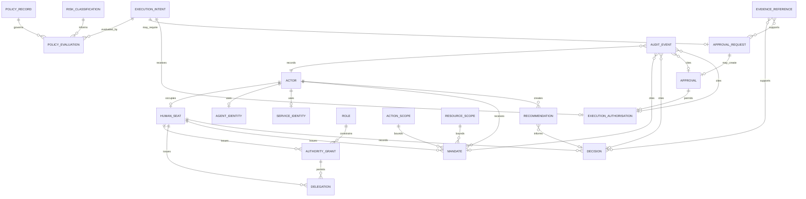
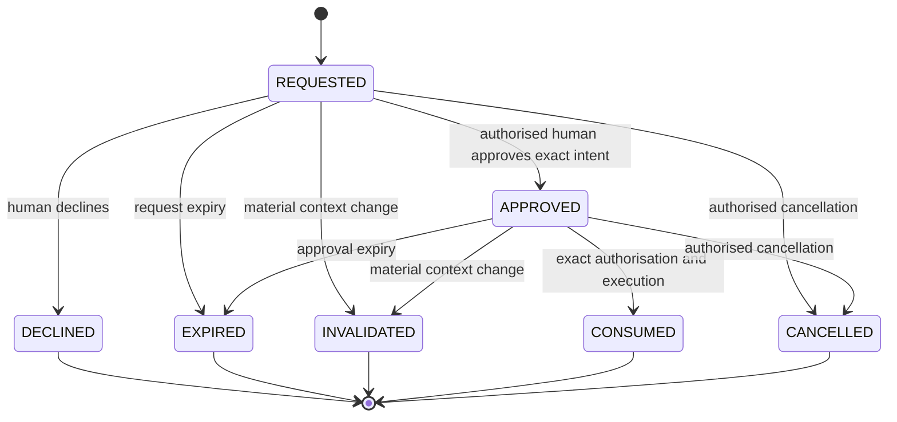
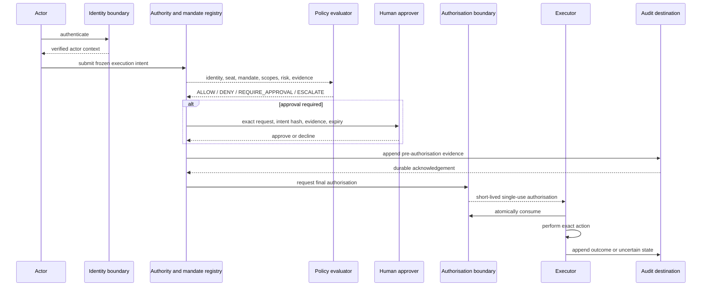

# Authority, Mandate, Approval And Audit System Design

- Document ID: `YSW-SD-AMAA`
- Version: 1.0
- Status: Governed system design; not implemented
- Classification: Public-safe architecture contract
- Owner: Governance
- Scope: Logical contracts only; no runtime, database, API, workflow, provider,
  topology, or infrastructure selection

## 1. Purpose

This document defines the implementation-level behavioural contract for the
future YSWORKS authority system. It makes authority, mandates, decisions,
approvals, execution authorisation, policy evaluation, and audit evidence
machine-checkable without prescribing their storage or runtime.

The system will later govern consequential actions initiated through n8n, YS AI
OS, the Client Workspace, infrastructure tooling, publication processes,
billing processes, destructive operations, and access administration. Naming a
consumer does not claim that the system, integration, or control exists.

This document does not authorise implementation, production access, workflow
changes, infrastructure changes, data collection, or exposure of private YS AI
OS design.

## 2. Authority And Conformance

This design is subordinate to:

1. [Volume I — Company Bible](../COMPANY_BIBLE.md), especially *I.V* and *I.X*;
2. [Volume II — Brand Bible](../BRAND_BIBLE.md);
3. [Volume III — Client Experience Constitution](../CLIENT_EXPERIENCE_CONSTITUTION.md),
   especially *III.V*, *III.XI*, *III.XIV*, and *III.XVII*;
4. [YSWORKS Enterprise Architecture](../YSWORKS_ENTERPRISE_ARCHITECTURE.md),
   especially *EA 5*, *EA 9*, *EA 10.3*, *EA 12.3*, and *EA 14*;
5. accepted ADRs within their explicit technical scope;
6. [YSWORKS Master Specification](../YSWORKS_MASTER_SPEC.md);
7. [Founder Handbook](../FOUNDER_HANDBOOK.md); and
8. stricter domain contracts, including the
   [Client Portal Foundation](CLIENT_PORTAL_FOUNDATION.md) and
   [Secure Public Platform Foundation](SECURE_PUBLIC_PLATFORM_FOUNDATION.md).

The private YS AI OS v3 architecture must conform to this contract wherever it
implements authority, orchestration, policy, approval, audit, memory, or agent
identity. Its private design is not reproduced here. A private conformance
review is an implementation prerequisite; any conflict stops implementation and
is escalated rather than resolved in this public document.

## 3. Normative Language And Invariants

`MUST`, `MUST NOT`, `SHOULD`, and `MAY` are normative.

1. Every consequential action MUST trace to exactly one accountable
   `HumanSeat`.
2. A machine MAY recommend and execute within an active mandate; it MUST NOT
   create, enlarge, renew, or reinterpret its own authority.
3. Recommendation is not decision or approval. Execution is not decision.
   Recommendation, decision, approval, execution, and audit are distinct
   records.
4. Delegation transfers bounded decision rights, not accountability.
5. Approval alone MUST NOT authorise execution.
6. Every consequential mutation MUST receive an `ExecutionAuthorisation`
   immediately before execution.
7. Authority, mandate, tenant, action, resource, risk, policy, evidence, intent
   hash, and approval context MUST match at authorisation time.
8. Material context change MUST invalidate prior approval and authorisation.
9. Mutations fail closed. Reads MAY degrade only when policy classifies the
   degraded result as safe.
10. Audit unavailability MUST block consequential mutation.
11. Records are append-only. Corrections supersede; they never overwrite.
12. Client-visible activity is a mediated, authorised projection and MUST NOT
    expose the internal audit trail.
13. An identifier supplied by an untrusted actor MUST NOT establish tenant,
    scope, role, authority, or ownership.
14. Denial, expiry, invalidation, revocation, cancellation, replay rejection,
    and failed authorisation MUST themselves be auditable.
15. No state machine may transition through an unrecorded intermediate state.
16. Exact retention periods, cryptographic algorithms, stores, and transport
    contracts remain governed implementation decisions.

## 4. Canonical Terminology

| Term | Meaning |
| --- | --- |
| Decision | A human selection among alternatives that creates obligation |
| Recommendation | Evidence-backed advice with no authority of its own |
| Approval | A specific human decision permitting an exact intended action |
| Execution | Performance of already-decided work |
| Automation | Execution by machine inside an active mandate |
| Delegation | Bounded transfer of decision rights; accountability remains with the issuing seat |
| Authority | Traceable chain from an action to the human seat entitled to cause it |
| Consequential | Capable of changing client, financial, access, production, publication, security, legal, relationship, or durable company state |
| Material change | Any change to actor, tenant, action, resource, parameters, risk, evidence, policy version, mandate, requested seat, expiry, or expected effect |

## 5. Actor Model

### 5.1 Actor Types

| Actor type | Human seat | May recommend | May decide | May approve | May execute | Required boundary |
| --- | --- | --- | --- | --- | --- | --- |
| Founder | Founder seat | Yes | Yes | Yes | Yes, through the applicable control path | Authenticated seat; final internal authority |
| Delegated human | Named delegated seat | Yes | Within active delegation | Within active delegation and policy | Yes | Delegation, scope, expiry, and audit |
| Client user | Named client seat | Yes | Client decisions within granted scope | Exact client objects when designated | Client actions only | Authenticated tenant membership and server-side authorisation |
| Internal operator | Named internal seat | Yes | Reversible operational decisions within delegation | When separately authorised | Yes | Assigned domain/resource scope; MFA where required |
| AI agent | None; linked accountable seat | Yes | No | No | Within active mandate | Agent identity, mandate, policy, evidence, and audit |
| n8n workflow | None; linked accountable seat | No independent judgement | No | No | Defined process steps only | Service identity, workflow version, mandate, policy, and audit |
| Service identity | None; linked accountable seat | No | No | No | Contracted machine action only | Non-human credential, exact action/resource scope, rotation and revocation |
| External provider | None | May submit untrusted input | No YSWORKS authority | No | Only provider-owned effects | Authenticated boundary, validation, allowlist, rate limits, and no implied trust |

### 5.2 Actor Rules

- An `Actor` is the universal subject. Human and machine identities are
  specialised records linked to it.
- A machine actor MUST link to the `HumanSeat` accountable for its current
  mandate. The link does not make the machine human.
- One person MAY occupy more than one role, but each decision MUST record the
  seat and delegation used.
- An authenticated identity without an active seat, role, grant, or mandate has
  no authority.
- Compromised, ambiguous, duplicated, or unverifiable identity causes
  quarantine and denial of mutation.
- External providers never receive a `HumanSeat`, `AuthorityGrant`, or implicit
  internal role.

## 6. Common Entity Contract

All entities MUST contain:

- an opaque, globally unique identifier;
- schema or contract version;
- creation timestamp;
- creator actor;
- data classification;
- integrity metadata;
- correlation and causation references where applicable; and
- a retention class.

Identifiers MUST be non-semantic and non-authoritative. Timestamps use a
governed UTC representation. Immutable fields are never edited; correction
creates a superseding record. “Mutation authority” below means authority to
transition state or create a superseding record, never authority to rewrite
history.

Retention classes are logical until legal and storage decisions are approved:

| Retention class | Contract |
| --- | --- |
| `IDENTITY` | Active life plus the approved revocation and audit period |
| `AUTHORITY` | Grant or delegation life plus the approved accountability period |
| `DECISION` | Obligation life plus contract, legal, and audit requirements |
| `EXECUTION` | Operational life plus rollback, incident, and audit requirements |
| `AUDIT` | Append-only period approved for classification and jurisdiction |
| `EVIDENCE` | At least as long as every record that depends on the evidence |
| `REFERENCE` | Active version plus supersession history |

## 7. Entity Contracts

### 7.1 Identity And Authority Entities

| Entity | Purpose and owner | Required fields | Immutable fields | Relationships |
| --- | --- | --- | --- | --- |
| `Actor` | Universal subject; Identity owner | actor ID, type, identity links, status, classification | ID, type, created time | has identities; occupies seats or receives mandates; causes events |
| `HumanSeat` | Human accountability and decision seat; Governance | seat ID, seat type, occupant identity, status, validity, assurance level | ID, seat type, original occupant, creation authority | held by Actor; issues decisions, grants, delegations, mandates, approvals |
| `AgentIdentity` | Verifiable AI-agent identity; Security | agent ID, runtime-independent name, owner seat, version, status, allowed identity mechanism | ID, original owner seat, created time | is Actor identity; receives Mandate; causes Recommendations and ExecutionIntents |
| `ServiceIdentity` | Verifiable non-agent machine identity; Security | service ID, owner seat, purpose, status, credential reference, rotation metadata | ID, purpose, original owner seat | is Actor identity; receives Mandate; executes authorised intents |
| `Role` | Named bundle of potential responsibilities; Governance | role ID, name, purpose, capability references, status, version | ID, version, published content | assigned through AuthorityGrant; never grants authority by name alone |
| `AuthorityGrant` | Direct bounded rights from Governance; Governance | grant ID, issuing seat, recipient seat, role/capabilities, action/resource/tenant scopes, risk ceiling, validity, conditions | ID, issuer, recipient, original scopes, issue evidence | may permit Decision or Approval; may be basis for Delegation |
| `Delegation` | Bounded transfer of decision rights; issuing HumanSeat | delegation ID, parent authority, issuer, recipient seat, decision/action/resource/tenant scopes, risk ceiling, validity, revocation conditions | ID, parent, issuer, recipient, original bounds | derives from AuthorityGrant or Founder seat; supports Decision or Approval |

| Entity | States and allowed transitions | Creation and mutation authority | Retention and audit |
| --- | --- | --- | --- |
| `Actor` | `PENDING → ACTIVE → SUSPENDED → ACTIVE`; `PENDING/ACTIVE/SUSPENDED → REVOKED`; no exit from `REVOKED` | Identity authority creates; Security may suspend; Governance revokes | `IDENTITY`; audit creation, activation, suspension, reactivation, revocation |
| `HumanSeat` | `VACANT → ACTIVE → SUSPENDED → ACTIVE`; `ACTIVE/SUSPENDED → RETIRED`; `ACTIVE → VACANT` only through recorded transfer | Founder creates Founder/delegated/internal seats; governed client process creates client seats; only Governance changes status | `AUTHORITY`; audit occupancy, assurance, suspension, transfer, retirement |
| `AgentIdentity` | `PROVISIONED → ACTIVE → QUARANTINED → ACTIVE`; any non-revoked state → `REVOKED` | Security provisions; owner seat requests activation; Security quarantines/revokes | `IDENTITY`; audit identity version, owner, activation, quarantine, revocation |
| `ServiceIdentity` | `PROVISIONED → ACTIVE → SUSPENDED → ACTIVE`; any state → `REVOKED` | Security provisions and rotates; owner seat requests; Security suspends/revokes | `IDENTITY`; audit provisioning, rotation, use outside norm, suspension, revocation |
| `Role` | `DRAFT → PUBLISHED → SUPERSEDED`; `PUBLISHED → RETIRED`; no content mutation after publication | Governance publishes; domain owner proposes; only new version supersedes | `REFERENCE`; audit publication, assignment-impact review, supersession |
| `AuthorityGrant` | `DRAFT → ACTIVE → SUSPENDED → ACTIVE`; `ACTIVE/SUSPENDED → EXPIRED/REVOKED/SUPERSEDED` | Founder or authorised Governance seat creates; issuer or Founder suspends/revokes; content never expands in place | `AUTHORITY`; audit issue, use, attempted overreach, suspension, expiry, revocation |
| `Delegation` | `DRAFT → ACTIVE → SUSPENDED → ACTIVE`; `ACTIVE/SUSPENDED → EXPIRED/REVOKED/SUPERSEDED` | Seat holding delegable right creates; issuer or Founder revokes; recipient cannot modify or redelegate unless explicitly permitted | `AUTHORITY`; audit chain, bounds, use, attempted self-expansion, expiry, revocation |

### 7.2 Mandate, Policy And Scope Entities

| Entity | Purpose and owner | Required fields | Immutable fields | Relationships |
| --- | --- | --- | --- | --- |
| `Mandate` | Exact machine execution boundary; issuing HumanSeat | mandate ID/version, issuer seat, actor, permitted and prohibited actions, resource/tenant scope, classifications, risk ceiling, gates, validity, revocation conditions, evidence, tools, external allowlist, rate/volume limits, fail-closed conditions | ID, version, issuer, recipient, all published bounds | issued to machine Actor; uses ActionScope, ResourceScope, RiskClassification, PolicyRecord |
| `PolicyRecord` | Descriptive rule set approved for publication; Governance/policy owner | policy ID/version, owner, scope, normative rules, status, effective/expiry times, source decisions, integrity digest | ID, version, published content, digest | consumed by PolicyEvaluation; references risk and scopes |
| `PolicyEvaluation` | Immutable evaluation result for current context; Policy service owner | evaluation ID, policy versions, actor, seat, mandate, action/resource/tenant, risk, evidence, context digest, outcome, reasons, evaluated time, expiry | all fields after evaluation | evaluates ExecutionIntent; may require ApprovalRequest; cited by authorisation |
| `RiskClassification` | Governed risk result and model version; Governance/Security | classification ID, model version, class, reasons, action/resource/tenant, classifier actor, evidence, time | ID, model version, result, context digest | informs policy, approval, expiry, rollback, evidence |
| `ResourceScope` | Exact resource and tenant boundary; resource owner | scope ID/version, resource type, opaque resource IDs or selector contract, tenant, environment, exclusions, owner | ID, version, tenant, published bounds | used by grants, delegations, mandates, intents, approvals |
| `ActionScope` | Exact permitted operation and parameter boundary; domain owner | scope ID/version, action name, parameter contract, effects, prohibited variants, idempotency expectation | ID, version, published action/parameter bounds | used by grants, mandates, intents, policy and authorisation |

| Entity | States and allowed transitions | Creation and mutation authority | Retention and audit |
| --- | --- | --- | --- |
| `Mandate` | `DRAFT → PROPOSED → ACTIVE → SUSPENDED → ACTIVE`; `ACTIVE/SUSPENDED → EXPIRED/REVOKED/SUPERSEDED`; only a new version may change bounds | Domain owner proposes; issuing HumanSeat activates; issuer or Governance suspends/revokes; recipient cannot mutate | `AUTHORITY`; audit issue, activation, every evaluation/use, limit breach, stop, expiry, revocation |
| `PolicyRecord` | `DRAFT → REVIEWED → PUBLISHED → SUPERSEDED/RETIRED`; no evaluation from draft or retired policy | Policy owner authors; authorised human publishes; new version supersedes | `REFERENCE`; audit review, publication, effective time, supersession, attempted use of unpublished policy |
| `PolicyEvaluation` | `EVALUATED → EXPIRED/SUPERSEDED`; outcome is immutable | Authorised evaluator creates from published policy; no actor edits outcome | `EXECUTION`; audit inputs, policy versions, result, reason, expiry, evaluator integrity |
| `RiskClassification` | `CLASSIFIED → EXPIRED/SUPERSEDED`; result is immutable | Governed classifier or authorised human creates; policy determines reclassification triggers | `DECISION`; audit model version, context, result, override attempt, supersession |
| `ResourceScope` | `DRAFT → PUBLISHED → SUPERSEDED/RETIRED` | Resource owner proposes; authorised domain seat publishes | `REFERENCE`; audit tenant/resource bounds and all supersession |
| `ActionScope` | `DRAFT → PUBLISHED → SUPERSEDED/RETIRED` | Domain owner proposes; authorised Governance/domain seat publishes | `REFERENCE`; audit effect/parameter bounds and supersession |

### 7.3 Recommendation, Decision And Approval Entities

| Entity | Purpose and owner | Required fields | Immutable fields | Relationships |
| --- | --- | --- | --- | --- |
| `Recommendation` | Evidence-backed advice without authority; recommending actor | recommendation ID/version, actor, accountable seat, subject, alternatives, recommendation, uncertainty, evidence, issued time | issued content, actor, evidence snapshot | may inform Decision; never becomes Approval |
| `Decision` | Human selection creating obligation; deciding HumanSeat | decision ID, seat, authority/delegation, subject, alternatives, selected outcome, reasons, evidence, risk, effective/expiry terms | ID, deciding seat, selected outcome, recorded reasons/evidence | may issue Mandate, Approval or policy publication; may supersede earlier Decision |
| `ApprovalRequest` | Request for one exact human decision; requesting domain | request ID, execution intent ID/hash, actor, action/resource/tenant, risk, evidence package/digest, policy evaluation/result, expiry, requested approver seat | request ID, intent/hash, actor, scopes, risk, evidence digest, policy result, seat, expiry | may create Approval; tracks required approval lifecycle |
| `Approval` | Authenticated human permission for exact intent; approving HumanSeat | approval ID, request ID, approver seat/identity, authority/delegation, intent hash, scopes, evidence digest, policy evaluation, issued/expiry times, use count limit | all issued fields | consumed by ExecutionAuthorisation; invalidated by context change |

| Entity | States and allowed transitions | Creation and mutation authority | Retention and audit |
| --- | --- | --- | --- |
| `Recommendation` | `DRAFT → ISSUED → CONSIDERED → CLOSED`; `DRAFT/ISSUED → WITHDRAWN`; `ISSUED/CONSIDERED → SUPERSEDED` | Actor drafts/issues within mandate or role; only issuer withdraws; decision-maker records consideration separately | `DECISION`; audit issue, evidence, withdrawal, supersession, linked decision |
| `Decision` | `RECORDED → EFFECTIVE → EXPIRED/REVOKED/SUPERSEDED`; content never edited | Authenticated HumanSeat with applicable authority creates; same or superior seat may revoke/supersede within law/contract | `DECISION`; audit authority chain, alternatives, evidence, effect, supersession |
| `ApprovalRequest` | Exact model in section 9: `REQUESTED`, `APPROVED`, `DECLINED`, `EXPIRED`, `INVALIDATED`, `CONSUMED`, `CANCELLED` | Authorised requester creates; requested seat decides; system expires/invalidates/consumes under contract; requester may cancel before consumption | `DECISION`; audit every transition, validation input, reason, replay and mismatch |
| `Approval` | `ACTIVE → CONSUMED/EXPIRED/INVALIDATED/CANCELLED`; no reactivation | Created only from `APPROVED` request by authenticated requested seat; system consumes/invalidates; approver may cancel before use | `DECISION`; audit issuance, identity assurance, use attempt, consumption, expiry, invalidation |

### 7.4 Execution, Evidence And Audit Entities

| Entity | Purpose and owner | Required fields | Immutable fields | Relationships |
| --- | --- | --- | --- | --- |
| `ExecutionIntent` | Frozen description of one proposed effect; initiating domain | intent ID/version, actor, accountable seat, mandate, action/resource/tenant, canonical parameters, expected effect, risk, evidence, created/expiry times, intent hash | frozen fields and hash after `FROZEN` | evaluated by policy; may create ApprovalRequest and ExecutionAuthorisation |
| `ExecutionAuthorisation` | Final short-lived permission immediately before action; authorisation service owner | authorisation ID, intent ID/hash, actor, seat, mandate/version, action/resource/tenant, risk, policy evaluation, approval if required, issued/expiry, nonce, maximum uses `1` | all fields | consumed by exact execution; causes AuditEvent |
| `AuditEvent` | Append-only witness of state and authority; Observability/Audit owner | event ID, timestamp, correlation/causation IDs, actor, human seat, tenant, action, resource, previous/resulting state, mandate, decision, approval, authorisation, policy result, evidence, classification, outcome, reason, integrity metadata | every appended field | links all consequential records; may be superseded only by corrective event |
| `EvidenceReference` | Stable reference to reviewable evidence; evidence owner | evidence ID/version, owner, classification, location abstraction, digest, provenance, captured time, expiry, accessibility rule | ID, version, digest, provenance snapshot | used by recommendation, decision, risk, policy, approval, execution and audit |

| Entity | States and allowed transitions | Creation and mutation authority | Retention and audit |
| --- | --- | --- | --- |
| `ExecutionIntent` | `DRAFT → FROZEN → AUTHORISED → EXECUTING → SUCCEEDED/FAILED/PARTIAL/UNKNOWN`; `DRAFT/FROZEN → CANCELLED`; changed context creates `SUPERSEDED` intent | Actor drafts within role/mandate; authorised system freezes; only authorisation/execution result advances later states | `EXECUTION`; audit freeze/hash, evaluation, authorisation, start, result, timeout, uncertainty |
| `ExecutionAuthorisation` | `ISSUED → CONSUMED`; `ISSUED → EXPIRED/INVALIDATED`; terminal states never reactivate | Authorisation service creates after all checks; exact executor consumes atomically; system invalidates on context change | `EXECUTION`; audit issuance inputs, nonce, use, replay, expiry, mismatch |
| `AuditEvent` | `APPENDED`; correction creates a new `APPENDED` event that references and supersedes, never changes, the original | Only authorised audit writer appends; subjects cannot edit/delete; corrective authority appends correction | `AUDIT`; event is the audit; integrity verification and access are also audited |
| `EvidenceReference` | `REGISTERED → VERIFIED → EXPIRED/REVOKED/SUPERSEDED`; no digest mutation | Evidence owner registers; governed verifier verifies; source owner/Security revokes; new version supersedes | `EVIDENCE`; audit provenance, digest verification, access, expiry, revocation |

## 8. Entity Relationships

The diagram is logical. It does not prescribe tables, services, databases,
keys, endpoints, or deployment boundaries.

## 9. Approval State Machine

### 9.1 Exact Transitions

| From | To | Required condition |
| --- | --- | --- |
| — | `REQUESTED` | Frozen intent, active mandate, current risk and policy evaluation, evidence digest, exact requested seat, future expiry |
| `REQUESTED` | `APPROVED` | Requested authenticated HumanSeat holds current authority; intent and all context still match |
| `REQUESTED` | `DECLINED` | Requested HumanSeat declines with recorded reason |
| `REQUESTED` | `EXPIRED` | Expiry reached before approval or consumption |
| `REQUESTED` | `INVALIDATED` | Material context changes, mandate/policy/seat becomes invalid, or evidence integrity fails |
| `REQUESTED` | `CANCELLED` | Authorised requester cancels before decision |
| `APPROVED` | `CONSUMED` | Matching authorisation is issued and exact execution consumes the single use |
| `APPROVED` | `EXPIRED` | Approval expiry reached before consumption |
| `APPROVED` | `INVALIDATED` | Any material context changes or required authority/policy ceases to be valid |
| `APPROVED` | `CANCELLED` | Approver or authorised requester cancels before consumption |

`DECLINED`, `EXPIRED`, `INVALIDATED`, `CONSUMED`, and `CANCELLED` are terminal.
A new attempt requires a new `ExecutionIntent`, hash, policy evaluation, and
request. An approval never returns to `REQUESTED` or `APPROVED`.

### 9.2 State Diagram

### 9.3 Replay And Staleness Rules

The system MUST reject and audit:

- reuse of a consumed approval or authorisation;
- an approval linked to another actor, action, resource, tenant, or intent;
- any parameter or canonical serialisation change;
- changed evidence content, digest, availability, or classification;
- a newer policy, risk model, mandate, delegation, scope, or resource version
  when policy marks the change material;
- an expired, suspended, revoked, or superseded seat, grant, delegation,
  mandate, policy, request, approval, or evidence reference;
- mismatched correlation or causation where continuity is required;
- multiple concurrent consumption attempts; and
- an execution request with an already-used idempotency identity.

## 10. Execution Authorisation

### 10.1 Authorisation Checks

Immediately before a consequential action, the authorisation boundary MUST:

1. authenticate the actor;
2. resolve the accountable HumanSeat;
3. verify active identity, grant/delegation, and mandate;
4. validate exact action, resource, tenant, environment, parameters, tool, data
   classification, volume, and risk bounds;
5. perform a current evaluation using published policy;
6. require and validate an active Approval when the policy outcome is
   `REQUIRE_APPROVAL`;
7. verify the immutable intent hash and evidence digests;
8. verify that the append-only audit destination can accept the pre-execution
   event;
9. atomically issue one short-lived, actor-specific, action-specific,
   resource-specific, tenant-specific, non-transferable authorisation; and
10. atomically consume it when execution begins.

An `ALLOW` policy result is necessary but not sufficient. Missing or ambiguous
context produces `DENY` or `ESCALATE`, never implied permission.

### 10.2 Execution Sequence

If durable audit acknowledgement is unavailable, the sequence stops before
authorisation.

## 11. Policy Model

### 11.1 Descriptive Policy

A `PolicyRecord` is a governed, descriptive and normative artefact. Draft or
unpublished documents do not decide runtime requests. Publication requires an
authorised human decision, version, effective time, scope, integrity digest, and
supersession relationship.

### 11.2 Policy Evaluation

A policy evaluator consumes:

- exact published policy versions;
- authenticated actor and accountable seat;
- active grants, delegation, and mandate;
- action, resource, tenant, environment, and data classification;
- current risk classification;
- frozen intent and canonical parameters;
- evidence references and integrity state;
- current time, rate/volume state, and relevant failure context.

It produces one immutable result:

| Outcome | Meaning |
| --- | --- |
| `ALLOW` | Policy permits progression to final authorisation checks |
| `DENY` | Policy forbids the request; no approval can override unless a separate human security-exception decision is permitted |
| `REQUIRE_APPROVAL` | Exact human approval is required before final authorisation |
| `ESCALATE` | Context is incomplete, conflicting, beyond risk ceiling, or requires a higher human seat |

An evaluator MUST NOT turn descriptive prose into an inferred permission. If a
rule cannot be evaluated deterministically, the result is `ESCALATE` or `DENY`.

## 12. Risk Classification

The example R0–R4 model is adopted with stricter separation between harmless
reads, internal mutation, client effect, consequential company action, and
critical or irreversible action.

| Class | Definition | Allowed actors | Approval and Founder requirement | Audit, rollback, evidence, expiry, escalation |
| --- | --- | --- | --- | --- |
| `R0` | Public or authorised read with no consequential effect | Human, client, machine, or external provider at its own boundary | No approval unless policy elevates; no Founder requirement | Access audit where classification requires; no rollback; minimal provenance; short context validity; deny unsafe degraded reads |
| `R1` | Reversible internal mutation with no client, money, access, publication, production, or restricted-data effect | Delegated human, operator, agent, workflow, service identity | Active authority or mandate; approval only when policy requires; no Founder requirement | Mutation audit mandatory; tested reversal or compensating action; proportional evidence; short authorisation; escalate scope ambiguity |
| `R2` | Reversible client-affecting or tenant-scoped mutation without an always-human commitment | Client user or delegated internal human; machine only under mandate | Exact designated human approval by default; Founder only if policy or absent delegation requires | Full tenant-aware audit; rollback/compensation required; client-safe evidence; approval and authorisation expiry; escalate cross-tenant or disputed authority |
| `R3` | Money, publication, elevated access, non-critical production, binding commitment, or material security action | Authenticated HumanSeat decides; machine may prepare and execute after approval | Always human; Founder or explicit bounded human delegation where constitution, law, contract, and policy allow | Append-only audit before mutation; explicit rollback or accepted irreversibility; complete evidence; brief single-use authorisation; escalate any exception |
| `R4` | Destructive, restricted-data, major security, critical production, constitutional, relationship-ending, or irreversible client action | Founder seat; executor may be a separately authorised human or machine | Founder required. No action during Founder absence unless a future approved emergency delegation explicitly covers it | Highest-integrity audit and evidence; rehearsed rollback where possible; explicit residual-risk record; shortest practical expiry; ambiguity or unavailable Founder means fail closed |

Risk MUST be recalculated when context changes. Splitting one R3/R4 action into
smaller operations MUST NOT lower its aggregate risk.

## 13. Always-Human Actions

The following always require a recorded authenticated human decision and cannot
be decided by an AI agent, workflow, service identity, policy evaluator, or
external provider:

- constitutional interpretation or amendment;
- accepting or refusing an engagement;
- client scope, dates, prices, promises, and other commitments;
- movement of money;
- beginning or ending client, provider, or personnel relationships;
- security exceptions;
- elevated access beyond standing policy;
- irreversible action affecting client data or systems;
- public statements in the company name;
- critical production changes;
- any action policy marks as human-required; and
- any new action whose decision class is not yet governed.

Machines MAY gather evidence, classify risk, draft recommendations, prepare
execution intents, present approval requests, execute the exact authorised
action, and append audit evidence. They MUST stop when judgement, scope,
exception, or a new decision is encountered.

## 14. Audit Contract

### 14.1 Append-Only Event

Every `AuditEvent` MUST include:

- event ID and governed timestamp;
- correlation ID and causation ID;
- actor identity and actor type;
- accountable HumanSeat;
- tenant context or explicit no-tenant marker;
- action and resource;
- previous state and resulting state;
- mandate ID/version;
- decision ID;
- approval request and approval IDs;
- execution authorisation ID;
- policy evaluation ID, versions, outcome, and reason;
- evidence references and digests;
- data classification;
- execution outcome and reason; and
- integrity metadata sufficient to detect alteration and ordering failure.

Optional identifiers MUST use an explicit absent value; they MUST NOT be
silently omitted when the event contract requires the field.

### 14.2 Audit Rules

- A durable pre-action event is required before consequential authorisation.
- The outcome event records success, failure, partial effect, timeout, or
  unknown result.
- Audit subjects cannot delete, rewrite, or alter their own history.
- Corrections are new events linked to and superseding the erroneous event.
- Audit access, export, integrity verification, retention action, and attempted
  deletion are themselves audited.
- Client-visible activity is separately projected through tenant and field
  authorisation. Raw event identifiers, internal actors, policies, mandates,
  topology, security details, and unrelated client information remain private.
- Retention and deletion follow classification, law, contracts, client rights,
  and the approved audit schedule. Expiry never permits silent destruction.

## 15. Permissions Matrix

| Capability | Founder | Delegated human | Client user | Internal operator | AI agent | n8n workflow | Service identity | External provider |
| --- | --- | --- | --- | --- | --- | --- | --- | --- |
| Create recommendation | Yes | Yes | Within client scope | Within assignment | Within mandate | No judgement | Contracted result only | Untrusted input only |
| Record company decision | Yes | Within delegation | No | Reversible scope only if delegated | No | No | No | No |
| Record client decision | Never impersonate client | No | Exact authorised scope | No | No | No | No | No |
| Issue authority grant | Yes | Only if explicitly delegable | No | No | No | No | No | No |
| Issue delegation | Yes | Only within delegable parent | No | No | No | No | No | No |
| Issue machine mandate | Yes | Within delegation | No | Within explicit delegation | No | No | No | No |
| Approve exact intent | Yes | Within delegation | Client-owned object only | If separately authorised | No | No | No | No |
| Publish policy | Yes | Authorised policy seat | No | No | No | No | No | No |
| Evaluate policy | May review | May review | No | May request | Yes, deterministic | May invoke | Yes, deterministic | No |
| Issue execution authorisation | No direct manual bypass | No direct manual bypass | No | No | No | No | Authorisation boundary only | No |
| Execute authorised action | Yes | Yes | Client action only | Yes | Within mandate | Within mandate | Exact contract | Provider-owned action only |
| Alter audit history | No | No | No | No | No | No | No | No |

## 16. Failure Model

| Failure | Mutation behaviour | Safe read behaviour | Required evidence and recovery |
| --- | --- | --- | --- |
| Identity unavailable or ambiguous | Deny | Only previously authorised non-sensitive cached read if policy permits | Record locally safe failure signal; re-authenticate; never infer identity |
| Mandate unavailable, expired, suspended, or revoked | Deny | Read only within separate valid read authority | Audit rejection; obtain new mandate from human issuer |
| Policy unavailable or no applicable published rule | Deny or `ESCALATE` | Only explicitly safe degraded read | Preserve context; restore evaluator; rerun current policy |
| Approval unavailable | Stop at gate | Unaffected authorised reads may continue | Record pending/denied state; human decides through governed path |
| Approval stale or mismatched | Invalidate and deny | No effect | Audit mismatch; create new intent and request |
| Audit unavailable | Deny all consequential mutation | Safe read may degrade under policy | Preserve non-sensitive diagnostic evidence; restore durable audit before retry |
| Authority/Registry unavailable | Deny | Only independently verifiable safe read | No cached mutation authority; restore and re-evaluate |
| Actor compromised | Quarantine identity; revoke/suspend grants and mandates | Deny or tightly limited incident view | Preserve evidence, notify Security/Governance, rotate identity, review history |
| Execution timeout | Do not retry blindly; mark `UNKNOWN` | Status may report uncertainty without private detail | Quarantine intent; reconcile actual effect; human decides retry/compensation |
| Partial execution | Stop further effects; mark `PARTIAL` | Report mediated state | Preserve evidence; run authorised compensation or escalate |
| Duplicate execution request | Reject or return prior idempotent result without re-execution | Prior safe result may be read | Audit duplicate and original authorisation reference |
| Founder unavailable | R4 and ungrantable approvals stop; existing narrow mandates may continue | Safe reads and reversible operations within mandate may continue | Preserve commitments and evidence; never improvise authority; apply *EA 12.3* |

## 17. YSW-OPS-001 Prototype Alignment

No governed repository artefact describing `YSW-OPS-001 — Client Intake and
Qualification` was available during this design. The following Founder-supplied
findings are treated as design inputs, not verified runtime state. The live
workflow was not inspected or modified and MUST remain disabled.

| Prototype finding | Final-system replacement |
| --- | --- |
| Synthetic approval is not production approval | Replace the placeholder with an `ApprovalRequest` bound to a frozen `ExecutionIntent`, authenticated HumanSeat, policy result, evidence digest, expiry, and exact intent hash |
| Audit currently has no persistence | Require durable append acknowledgement before any consequential authorisation; no in-memory or best-effort log counts as audit |
| Duplicate early-exit bypass requires explicit policy | Publish an explicit duplicate-handling policy: deny mutation, link the original idempotency identity, audit the duplicate, and expose only the approved result |
| Audit logger should become reusable | Implement one governed audit-writer contract used by every workflow and subject to append-only, integrity, availability, classification, and access tests |
| Approval gate should become reusable | Implement one gate contract that accepts exact intent context and cannot be bypassed by workflow branching |
| Workflow must remain disabled | No enablement until prerequisites, negative tests, private conformance review, and separate Founder production authorisation pass |

Prototype identifiers, synthetic flags, temporary records, or workflow-local
state MUST NOT migrate into production authority. Migration creates new
governed records with provenance; it never upgrades a placeholder by renaming
it.

## 18. Implementation Prerequisites

Before runtime implementation:

1. approve the canonical serialisation and intent-hash contract;
2. approve identity assurance and HumanSeat binding for every actor type;
3. resolve the authority/mandate Registry ownership and availability contract;
4. publish the initial policy lifecycle and evaluator conformance contract;
5. approve the R0–R4 risk model or superseding model;
6. resolve audit store, integrity, access, retention, export, and recovery;
7. define atomic authorisation issuance and consumption semantics;
8. define idempotency and uncertain-outcome reconciliation;
9. define tenant derivation and scope validation independently of client input;
10. create manual paths for every critical automation;
11. perform private YS AI OS v3 conformance review;
12. review n8n prototype findings against the actual disabled workflow in its
    authorised private environment;
13. complete threat modelling and privacy review;
14. define observability without exposing audit subjects or private topology;
15. approve RPO/RTO and Founder-continuity decisions; and
16. obtain separate implementation and production authority.

## 19. Acceptance Criteria

The design is implementation-ready only when evidence shows:

- every canonical entity has a versioned contract and owner;
- all state transitions are exhaustively enumerated and default-deny;
- every consequential action resolves one accountable HumanSeat;
- machines cannot issue grants, delegations, mandates, decisions, or approvals;
- mandate scope cannot expand without a new human-issued version;
- policy evaluates only published versions and returns one governed outcome;
- approval binds exact actor, intent hash, action, resource, tenant, risk,
  evidence, policy, seat, and expiry;
- approval and authorisation consumption are atomic and single-use;
- stale, replayed, cross-tenant, cross-actor, and changed-context requests fail;
- audit unavailability blocks mutation;
- failures record `FAILED`, `PARTIAL`, or `UNKNOWN` without false success;
- corrections supersede and originals remain verifiable;
- client activity projections reveal no internal audit or other-tenant data;
- every R1–R4 mutation has proportional evidence and recovery behaviour;
- every R3/R4 action reaches a human gate;
- R4 fails closed during Founder absence unless approved emergency authority
  exists;
- the system remains operable through documented manual paths with automation
  disabled; and
- the authority trace, safe automation, isolation, honesty, and component
  failure Enterprise Tests pass.

## 20. Negative Test Catalogue

| ID | Attempt | Required result |
| --- | --- | --- |
| `NEG-AUTH-001` | Machine creates or enlarges its mandate | Deny, quarantine if repeated, audit attempted self-expansion |
| `NEG-AUTH-002` | Role name used without active grant/delegation | Deny and audit missing authority chain |
| `NEG-AUTH-003` | Delegation exceeds parent scope or risk ceiling | Deny creation and audit over-delegation |
| `NEG-AUTH-004` | Executor encounters an undecided parameter | Stop and escalate; no inferred decision |
| `NEG-APR-001` | Replay consumed approval | Deny and audit replay |
| `NEG-APR-002` | Reuse approval for another actor | Deny and invalidate request context |
| `NEG-APR-003` | Change action parameters after approval | Hash mismatch; deny and require new intent |
| `NEG-APR-004` | Change tenant or resource scope | Deny, invalidate, and raise isolation signal |
| `NEG-APR-005` | Change or remove evidence | Deny and invalidate |
| `NEG-APR-006` | Use approval after policy, mandate, seat, or risk change | Deny and require complete reevaluation |
| `NEG-APR-007` | Concurrent double consumption | Exactly one succeeds; all others deny and audit |
| `NEG-EXE-001` | Execute from approval without final authorisation | Deny and audit bypass attempt |
| `NEG-EXE-002` | Transfer authorisation to another actor | Deny and audit identity mismatch |
| `NEG-EXE-003` | Execute after authorisation expiry | Deny and require new evaluation |
| `NEG-EXE-004` | Retry unknown outcome automatically | Deny blind retry; quarantine and reconcile |
| `NEG-POL-001` | Evaluate draft or retired policy | Deny or escalate |
| `NEG-POL-002` | No deterministic rule applies | `ESCALATE` or `DENY`, never implicit allow |
| `NEG-AUD-001` | Audit destination unavailable | No consequential mutation |
| `NEG-AUD-002` | Subject edits or deletes own event | Deny, preserve event, audit attempt |
| `NEG-AUD-003` | Correction overwrites original | Reject; require superseding event |
| `NEG-TEN-001` | Browser-supplied tenant conflicts with identity context | Deny without revealing another tenant |
| `NEG-TEN-002` | Cross-tenant evidence or approval reference | Deny, quarantine context, raise security signal |
| `NEG-HUM-001` | Machine decides money, commitment, public statement, access exception, or R4 action | Deny and escalate to required HumanSeat |
| `NEG-ABS-001` | R4 request while Founder unavailable | Deny unless an approved exact emergency delegation exists |
| `NEG-N8N-001` | Workflow branch bypasses reusable gate | Validation failure; workflow remains disabled |
| `NEG-N8N-002` | Synthetic approval presented as production approval | Deny and label non-authoritative |

## 21. Open Decisions

- canonical serialisation and intent-hash algorithm;
- identity provider, assurance levels, and HumanSeat binding;
- Registry ownership, runtime, consistency, and availability;
- policy language, publication mechanism, evaluator runtime, and test format;
- final R0–R4 model and any domain-specific elevation rules;
- audit store, integrity mechanism, retention, export, access, and recovery;
- evidence storage and digest lifecycle;
- atomic authorisation issue/consume mechanism;
- idempotency identity and uncertain-outcome reconciliation;
- exact expiry ceilings by risk class;
- tenant derivation and resource-scope representation;
- notification and escalation channels;
- Founder-continuity and delegated emergency-authority mechanism;
- private YS AI OS v3 conformance findings;
- actual YSW-OPS-001 prototype review and migration disposition;
- legal effect and retention of client approvals;
- privacy roles, jurisdiction, and data-subject handling;
- observability implementation and separation from audit;
- API and event contracts;
- deployment topology, backup, RPO/RTO, and production hosting; and
- implementation and rollout sequence.

Until resolved, use the state with less authority, mutation, exposure, and
retention.

## 22. Documentation Validation Contract

Documentation review MUST confirm:

- Mermaid blocks are structurally complete;
- every entity has purpose, owner, fields, immutable fields, states,
  transitions, creation/mutation authority, retention, audit, and relationships;
- all approval terminal states and replay/staleness paths are covered;
- every R3/R4 path includes an authenticated human gate;
- audit failure blocks mutation consistently;
- tenant scope is explicit at request, approval, authorisation, execution, and
  audit boundaries;
- no public document claims implementation or exposes private YS AI OS
  topology; and
- local links, formatting, secret scan, build, and repository diff checks pass.

## 23. Closing

This design separates permission from capability and decision from execution.
Its central invariant is simple: a consequential action occurs only when a
traceable human authority, an exact mandate, current policy, sufficient
evidence, any required human approval, a single-use execution authorisation,
and durable audit all agree on the same intent.

When they do not agree, the system stops. It does not improvise authority.
