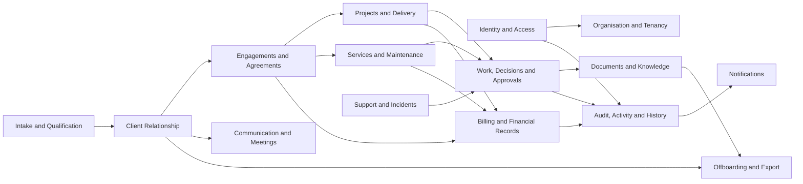
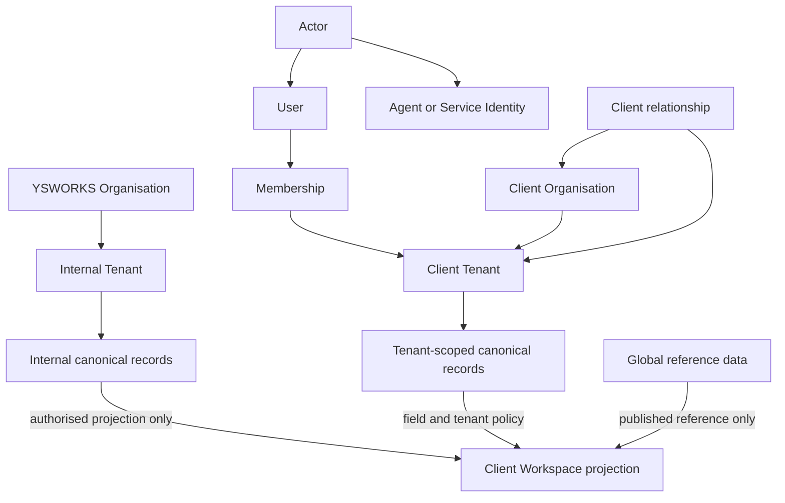
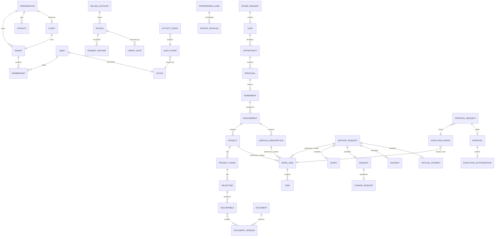
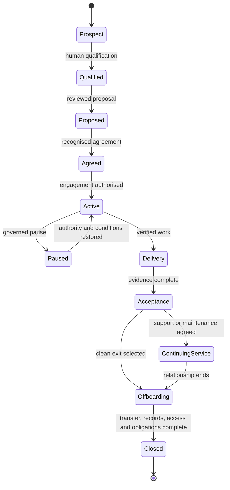

# YSWORKS Canonical Domain Model

- Document ID: `YSW-SD-CDM`
- Version: 1.0
- Status: Governed system design; not implemented
- Classification: Public-safe architecture contract
- Owner: Enterprise Architecture
- Scope: Logical domain contracts only; no physical schema, database, API,
  identity provider, event transport, file store, billing provider, workflow,
  runtime, or infrastructure selection

## 1. Purpose

This document defines the canonical business meanings shared by the future
Client Workspace, its Client Portal technical boundary, YS AI OS, n8n, storage,
APIs, delivery, support, billing, documents, audit, and access control. It
prevents each consumer from inventing a different meaning for the same company
record.

The model is implementation-level in precision but implementation-agnostic in
technology. It does not authorise collection, migration, integration,
authentication, automation, deployment, or production use.

## 2. Authority And Conformance

This design is subordinate to:

1. [Volume I — Company Bible](../COMPANY_BIBLE.md);
2. [Volume II — Brand Bible](../BRAND_BIBLE.md);
3. [Volume III — Client Experience Constitution](../CLIENT_EXPERIENCE_CONSTITUTION.md);
4. [YSWORKS Enterprise Architecture](../YSWORKS_ENTERPRISE_ARCHITECTURE.md);
5. accepted ADRs within their explicit technical scope; and
6. [Authority, Mandate, Approval And Audit System Design](AUTHORITY_MANDATE_APPROVAL_AUDIT_SYSTEM.md).

The [Client Portal Foundation](CLIENT_PORTAL_FOUNDATION.md) remains authoritative
for the technical security boundary and client-facing projection rules. A
conflict is reported and escalated; it is never silently resolved here.

`MUST`, `MUST NOT`, `SHOULD`, and `MAY` are normative.

## 3. Model-Wide Rules

1. Every operational record has exactly one owning domain.
2. Every tenant-scoped record has exactly one authoritative tenant at a time.
3. Cross-tenant access is denied by default and cannot be inferred from an
   identifier supplied by a caller.
4. Shared reference data is explicitly `GLOBAL_REFERENCE`; absence of a tenant
   is never interpreted as global access.
5. Internal records and Client Workspace projections are different contracts.
6. A projection never becomes the canonical record by being displayed.
7. Every consequential mutation traces to an authenticated `Actor`, one
   accountable `HumanSeat`, current authority, and an `AuditEvent`.
8. Machines act only within explicit mandates. They do not decide, approve,
   grant authority, or expand scope.
9. Identifiers are opaque, globally unique, non-semantic, non-enumerable, and
   non-authoritative. Their physical representation remains open.
10. Immutable fields are corrected through superseding records, not edits.
11. Status is derived from recorded state transitions, never from presentation
    copy.
12. Progress is calculated from verifiable milestone evidence and approved
    weighting rules. Fabricated or arbitrary percentages are forbidden.
13. No `Task` may exist without an authorised `WorkItem`. No `WorkItem` may
    exist without exactly one `Project`, `Service`, or `SupportRequest`
    context.
14. Every financial record MUST trace to an `Agreement` or an approved scope
    change.
15. Raw audit, prompts, agents, workflows, private topology, internal costs,
    secrets, and other-client data never enter a client projection.
16. Unresolved ownership, tenant, authority, or classification fails closed.

## 4. Domain Overview

| Domain | Purpose | Canonical owner |
| --- | --- | --- |
| Identity and Access | Identity, accountability, roles, permissions, and tenant membership | Security and Governance |
| Organisation and Tenancy | Business counterpart and isolation boundaries | Client Relationship and Security |
| Intake and Qualification | First contact, mutual qualification, and opportunity formation | Business and Sales |
| Client Relationship | The governed relationship with a client and its contacts | Client Success |
| Engagements and Agreements | Proposed, agreed, and active commitments | Founder and Commercial |
| Projects and Delivery | Delivery structure, verified progress, outputs, and acceptance | Engineering and Delivery |
| Work, Decisions and Approvals | Authorised work and exact human decision gates | Operations and Governance |
| Services and Maintenance | Service catalogue, recurring relationship, and preventive care | Service Delivery |
| Support and Incidents | Queries, requests, changes, incidents, and critical incidents | Support and Security |
| Documents and Knowledge | Versioned documents, evidence, and governed knowledge | Documentation |
| Communication and Meetings | Purposeful exchanges and their client-safe record | Client Success |
| Billing and Financial Records | Traceable commercial and financial records | Finance |
| Audit, Activity and History | Internal evidence, safe activity projections, and migrated history | Audit and Governance |
| Notifications | Governed attention requests derived from real events | Owning source domain |
| Offboarding and Export | Clean Exit, transfer, export, and relationship closure | Client Success and Governance |

## 5. Tenancy Model

### 5.1 Distinctions

| Concept | Canonical meaning | Must not mean |
| --- | --- | --- |
| `Organisation` | A real-world legal, commercial, or operating body | A login boundary or client relationship |
| `Tenant` | A technical isolation and policy context owned by one Organisation | A synonym for Organisation or Client |
| `Client` | YSWORKS' governed relationship with an Organisation | Every Organisation or every Contact |
| `User` | A human sign-in identity record | Authority, membership, or actor capability |
| `Membership` | Time-bounded association of one User with one Tenant | An identity or implicit cross-tenant permission |
| `Actor` | Universal human or machine subject that causes an action | Necessarily a User |

An Organisation MAY exist without becoming a Client. A prospective Client MAY
exist before a client Tenant is provisioned. Until provisioned, intake and
qualification records belong to the internal YSWORKS tenant and reference the
prospective Organisation. Provisioning never changes a record silently:
client-visible data is projected or transferred through an authorised,
auditable operation.

### 5.2 Tenant Classes

| Tenant class | Owner | Permitted content | Boundary |
| --- | --- | --- | --- |
| `INTERNAL` | YSWORKS Organisation | Company operations, private systems, internal knowledge, cross-client administration | Never projected wholesale to a client |
| `CLIENT` | One client Organisation | That client's authorised relationship, delivery, support, billing, and document records | No record or query crosses to another client tenant |
| `GLOBAL_REFERENCE` | Governed YSWORKS owner; not an operational tenant | Published service definitions, classifications, status vocabularies, schema versions | Read-only by policy; never used for client or operational facts |

Multi-party work retains one owning tenant and explicit participant
Organisation references. A record cannot acquire multiple owning tenants.
Cross-tenant aggregation is a separately authorised internal projection, never
a shared operational record.

### 5.3 Tenancy Diagram

## 6. Common Entity Contract

Every entity includes:

- opaque identifier and contract version;
- owning domain and accountable owner;
- tenant scope or explicit `GLOBAL_REFERENCE`;
- created time and creating Actor;
- current lifecycle state;
- data classification and retention category;
- correlation and causation references where applicable;
- integrity metadata; and
- supersession reference where correction is permitted.

Optional attributes are absent explicitly. They never inherit values from
another tenant or from presentation state. “Mutation” below means an allowed
state transition or a new superseding version, never rewriting immutable
history.

## 7. Entity Catalogue

The two tables for each group jointly define purpose, ownership, scope,
attributes, immutability, lifecycle, transitions, authority, visibility,
classification, retention, audit, relationships, invariants, and prohibited
uses.

### 7.1 Identity And Access

| Entity | Purpose; owner; tenant scope | Required attributes | Optional and immutable attributes | Relationships |
| --- | --- | --- | --- | --- |
| `User` | Human sign-in identity; Identity and Access; global identity with no operational access by itself | user ID, identity-provider subject abstraction, status, assurance metadata | display name, verified contacts; ID and original subject immutable | becomes Actor; joins Tenant only through Membership |
| `Actor` | Universal action subject; Identity and Access; explicit tenant context per action | actor ID, type, status, identity link, accountable seat where required | display label; ID, type, creation immutable | User, AgentIdentity, or ServiceIdentity; causes AuditEvent |
| `HumanSeat` | Human accountability seat; Governance; organisation or tenant scope | seat ID, type, occupant, validity, assurance, status | delegation limits; ID, type, original occupant immutable | held by Actor; issues decisions, grants, mandates, approvals |
| `AgentIdentity` | Verifiable AI-agent identity; Security; internal or exact tenant mandate scope | agent ID, owner seat, version, status, identity mechanism | descriptive capability; ID, version, original owner immutable | is Actor; receives mandate; never User |
| `ServiceIdentity` | Non-human service identity; Security; exact service and tenant scope | service ID, owner seat, purpose, status, credential reference | rotation metadata; ID, purpose, original owner immutable | is Actor; used by n8n or another governed service |
| `Role` | Named bundle of potential responsibilities; Governance; global reference or tenant-defined | role ID, name, purpose, capability references, version, status | description; published version immutable | assigned through Membership or authority grant |
| `Permission` | Atomic potential action statement; Governance; global reference or tenant-defined | permission ID, action scope, resource scope, constraints, version, status | risk hint; published version immutable | referenced by Role; never grants itself |
| `Membership` | User-to-Tenant association; Organisation and Tenancy; exactly one tenant | membership ID, user, tenant, role/grants, validity, status | client-safe title; ID, user, tenant, original grant immutable | authorises tenant context subject to server-side policy |

| Entity | Lifecycle and allowed transitions | Creation and mutation authority | Visibility, classification, retention, audit, invariants, prohibited uses |
| --- | --- | --- | --- |
| `User` | `INVITED → ACTIVE ↔ SUSPENDED → REVOKED`; invitation may `EXPIRE` | Governed identity process creates; Security suspends/revokes | Self and authorised identity operators; `CONFIDENTIAL`; `IDENTITY`; audit assurance/status. Must not imply membership or authority |
| `Actor` | `PENDING → ACTIVE ↔ QUARANTINED → REVOKED` | Identity authority creates; Security quarantines/revokes | Internal identity projection only; `CONFIDENTIAL`; `IDENTITY`; audit every status. Must not merge human and machine accountability |
| `HumanSeat` | Reuses the exact Authority System state model | Founder/Governance creates and changes occupancy | Seat holder and authorised Governance; `RESTRICTED`; `AUTHORITY`; full audit. Must not be occupied by a machine |
| `AgentIdentity` | Reuses the exact Authority System state model | Security provisions; owner requests; Security quarantines/revokes | Internal only; `RESTRICTED`; `IDENTITY`; full audit. Must not decide, approve, or self-expand |
| `ServiceIdentity` | Reuses the exact Authority System state model | Security provisions/rotates/revokes | Internal only; `RESTRICTED`; `IDENTITY`; full audit. Must not be shared or used outside purpose |
| `Role` | `DRAFT → PUBLISHED → SUPERSEDED/RETIRED` | Domain proposes; Governance publishes | Name may be client-visible; definition `INTERNAL`; `REFERENCE`; audit publication. Must not be treated as authority without grant |
| `Permission` | `DRAFT → PUBLISHED → SUPERSEDED/RETIRED` | Governance and domain owner publish | Internal; `INTERNAL`; `REFERENCE`; audit changes. Must not contain provider-specific credentials |
| `Membership` | `PENDING → ACTIVE ↔ SUSPENDED → EXPIRED/REVOKED` | Tenant owner requests; governed authority grants/revokes | User and tenant administrators within scope; `CONFIDENTIAL`; `IDENTITY`; full audit. Must not span tenants |

### 7.2 Organisation, Intake, And Client Relationship

| Entity | Purpose; owner; tenant scope | Required attributes | Optional and immutable attributes | Relationships |
| --- | --- | --- | --- | --- |
| `Organisation` | Real-world counterpart; Organisation and Tenancy; internal tenant until client tenant exists | organisation ID, legal/display name, type, status, provenance | registration details, addresses; ID and original provenance immutable | owns Tenant; may become Client; has Contacts |
| `Tenant` | Isolation boundary; Organisation and Tenancy; self | tenant ID, owning Organisation, class, status, policy boundary | region abstraction; ID, owner, class immutable | has Memberships and tenant-scoped records |
| `Client` | Governed YSWORKS relationship; Client Relationship; internal before provisioning, then exact client tenant | client ID, Organisation, relationship status, accountable seat, start basis | client-safe name, relationship notes; ID and Organisation immutable | has Contacts, Engagements, Tenant, OffboardingCase |
| `Contact` | Person relevant to an Organisation or Client; Client Relationship; exact client or internal prospect scope | contact ID, Organisation, name, contact purpose, status, provenance | channels, preferences; ID and Organisation immutable | may link to User only after verified onboarding |
| `IntakeRequest` | Captured first contact; Intake and Qualification; internal YSWORKS tenant | intake ID, source class, received time, supplied content, consent/provenance, status | contact/Organisation hints; ID and original submission immutable | may create Lead; never grants access |
| `Lead` | Potential relationship under mutual qualification; Intake and Qualification; internal tenant | lead ID, intake/provenance, owner seat, status, need summary | Contact and Organisation candidates; ID/provenance immutable | may create Opportunity or close |
| `Opportunity` | A qualified possibility for a defined engagement; Intake and Qualification; internal tenant | opportunity ID, Lead/Client, owner, need, fit evidence, status | indicative constraints, no unapproved promise; ID/source immutable | receives QualificationDecision; may produce Proposal |
| `QualificationDecision` | Human decision to proceed or refuse; Intake and Qualification; internal tenant | decision ID, opportunity, deciding seat, outcome, reasons, evidence, time | follow-up condition; all issued fields immutable | specialises Decision; gates Proposal |

| Entity | Lifecycle and allowed transitions | Creation and mutation authority | Visibility, classification, retention, audit, invariants, prohibited uses |
| --- | --- | --- | --- |
| `Organisation` | `CANDIDATE → VERIFIED → ACTIVE → INACTIVE`; correction supersedes | Intake may propose; authorised human verifies | Approved identity may be client-visible; `CONFIDENTIAL`; `RELATIONSHIP`; audit verification. Must not be created from unverified domain ownership alone |
| `Tenant` | `PLANNED → PROVISIONED → ACTIVE ↔ SUSPENDED → OFFBOARDING → CLOSED` | Security provisions; Governance activates/closes | Tenant identity visible to authorised members; `RESTRICTED`; `SECURITY`; full audit. Must not be reassigned to another Organisation |
| `Client` | `PROSPECT → QUALIFIED → ACTIVE ↔ PAUSED → OFFBOARDING → CLOSED`; may be `REFUSED` before active | Human qualification creates; Founder/delegate changes relationship | Client sees approved relationship facts; `CONFIDENTIAL`; `RELATIONSHIP`; full audit. Must not equate prospect with accepted engagement |
| `Contact` | `PROSPECTIVE → VERIFIED → ACTIVE ↔ INACTIVE → REMOVED` | Authorised relationship owner; subject correction rights apply | Own/authorised tenant view; `CONFIDENTIAL`; `RELATIONSHIP`; audit access/status. Must not imply User or authority |
| `IntakeRequest` | `RECEIVED → VALIDATED → TRIAGED → CONVERTED/CLOSED/REJECTED`; invalid input `QUARANTINED` | Public boundary receives; human or mandated classifier triages | Internal until approved response; `CONFIDENTIAL`; `TRANSIENT_INTAKE`; audit provenance and disposition. Must not execute or approve anything |
| `Lead` | `NEW → QUALIFYING → QUALIFIED/DISQUALIFIED/CLOSED`; qualified may `CONVERT` | Sales owner creates/mutates; machine may recommend only | Internal; `CONFIDENTIAL`; `RELATIONSHIP`; audit outcome. Must not be scored with fabricated certainty |
| `Opportunity` | `DISCOVERY → ASSESSED → QUALIFIED → PROPOSED → WON/LOST/WITHDRAWN` | Business owner; qualification and commitments require human seat | Internal; approved proposal shared separately; `CONFIDENTIAL`; `RELATIONSHIP`; audit material changes. Must not contain an accepted promise before Agreement |
| `QualificationDecision` | `RECORDED → EFFECTIVE → SUPERSEDED/REVOKED` | Founder or delegated human with evidence | Internal, with respectful client-safe outcome where appropriate; `CONFIDENTIAL`; `DECISION`; full audit. Machine must not decide acceptance/refusal |

### 7.3 Engagements, Projects, And Work

| Entity | Purpose; owner; tenant scope | Required attributes | Optional and immutable attributes | Relationships |
| --- | --- | --- | --- | --- |
| `Proposal` | Evidence-based proposed engagement; Commercial; internal authoring plus exact client projection | proposal ID/version, opportunity/client, scope, outputs, responsibilities, assumptions, exclusions, commercial shape, validity, status | schedule and support options; issued version immutable | may lead to Agreement; references Quote |
| `Agreement` | Binding recognised commitment; Commercial; exact client tenant and protected internal record | agreement ID/version, parties, accepted scope, obligations, effective terms, evidence, status | legal references; accepted version immutable | authorises Engagement, billing, and changes |
| `Engagement` | Operational boundary of one agreed client relationship; Client Relationship; exactly one client tenant | engagement ID, agreement, client, owner seat, purpose, status | summary and review cadence; ID, client, source agreement immutable | contains Projects, subscriptions, communications, billing |
| `Project` | Bounded delivery endeavour; Projects and Delivery; exactly one tenant | project ID, engagement, title, approved purpose, owner, status, current phase | approved dates, health explanation; ID, tenant, engagement immutable | has phases, milestones, deliverables, work |
| `ProjectPhase` | Ordered delivery stage; Projects and Delivery; project tenant | phase ID, project, name, sequence, entry/exit criteria, status | estimate, dependency; ID, project, sequence version immutable | groups Milestones and WorkItems |
| `Milestone` | Verifiable outcome checkpoint; Projects and Delivery; project tenant | milestone ID, project/phase, outcome, criteria, evidence requirement, weight rule, status | estimate, visible owner; ID, criteria version, weight version immutable once active | supports verified progress; produces Deliverables |
| `Deliverable` | Versioned reviewable output; Projects and Delivery; project tenant | deliverable ID, project/milestone, title, current version, review state, owner | client-safe description; ID, project, source milestone immutable | has DocumentVersion or governed artefact reference |
| `WorkItem` | Authorised unit of intended work; Work domain; context tenant | work item ID, Project/Service/Support context, purpose, authority basis, owner, acceptance evidence, status | estimate, dependencies; ID, tenant, context immutable | authorises one or more Tasks |
| `Task` | Executable decomposition of authorised work; Work domain; WorkItem tenant | task ID, work item, action, assignee Actor, status, completion evidence rule | estimate, dependency; ID, WorkItem, tenant immutable | cannot exist without active authorised WorkItem |

| Entity | Lifecycle and allowed transitions | Creation and mutation authority | Visibility, classification, retention, audit, invariants, prohibited uses |
| --- | --- | --- | --- |
| `Proposal` | `DRAFT → REVIEWED → ISSUED → ACCEPTED/DECLINED/EXPIRED/WITHDRAWN/SUPERSEDED` | Human commercial owner issues; client accepts through governed evidence | Issued client version visible; internal drafts hidden; `CONFIDENTIAL`; `CONTRACTUAL`; full audit. Must not become Agreement by status rename |
| `Agreement` | `DRAFT → PENDING_ACCEPTANCE → ACTIVE ↔ SUSPENDED → EXPIRED/TERMINATED/SUPERSEDED` | Founder/delegate and authorised client counterpart | Parties see recognised version; `RESTRICTED`; `CONTRACTUAL`; full audit. Must not be changed in place after acceptance |
| `Engagement` | `PLANNED → ACTIVE ↔ PAUSED → COMPLETING → COMPLETED/TERMINATED` | Created from active Agreement; relationship authority changes state | Client-visible summary; `CONFIDENTIAL`; `RELATIONSHIP`; audit. Must not exist without agreement basis |
| `Project` | `CANDIDATE → DISCOVERY → PROPOSED → AGREED → ACTIVE → ACCEPTANCE → HANDOVER → MAINTENANCE/CLOSED`; may `PAUSE/CANCEL` by governed path | Delivery proposes; authorised human activates/pauses/closes | Approved projection visible; `CONFIDENTIAL`; `CONTRACTUAL`; audit state and progress evidence. Must not report invented progress |
| `ProjectPhase` | `PLANNED → READY → ACTIVE ↔ BLOCKED → COMPLETED`; may `SKIP/CANCEL` with decision | Project authority creates; owner transitions with evidence | Client-visible where approved; `CONFIDENTIAL`; `CONTRACTUAL`; audit skip/complete. Must not complete without exit evidence |
| `Milestone` | `PLANNED → READY → IN_PROGRESS ↔ BLOCKED → ACHIEVED → ACCEPTED`; may `REJECT/SUPERSEDE/CANCEL` | Project owner progresses; authorised client/human accepts where required | Approved criteria/status visible; `CONFIDENTIAL`; `CONTRACTUAL`; full evidence audit. Must not use arbitrary completion percentage |
| `Deliverable` | `DRAFT → INTERNAL_REVIEW → ISSUED → ACCEPTED/CHANGES_REQUESTED → SUPERSEDED`; may `WITHDRAW` before acceptance | Delivery authors; exact authorised counterpart reviews | Issued versions visible; drafts hidden; classification follows content; `CONTRACTUAL`; full version/audit. Must not overwrite accepted version |
| `WorkItem` | `PROPOSED → AUTHORISED → ACTIVE ↔ BLOCKED → COMPLETED/CANCELLED/SUPERSEDED` | Human authority or valid mandate proposes; applicable authority authorises | Client-visible summary only when approved; `INTERNAL` or higher; `EXECUTION`; full audit. Must have exactly one Project, Service, or Support context |
| `Task` | `PLANNED → READY → ACTIVE ↔ BLOCKED → COMPLETED/CANCELLED` | WorkItem owner creates; assigned Actor executes within authority | Usually internal; safe action may project; inherits classification/retention; audit consequential transitions. Must not create scope or outlive WorkItem |

### 7.4 Decisions, Approvals, And Execution

| Entity | Purpose; owner; tenant scope | Required attributes | Optional and immutable attributes | Relationships |
| --- | --- | --- | --- | --- |
| `Decision` | Human selection creating obligation; Governance; exact context tenant | fields defined by Authority System | subject-specific client explanation; issued record immutable | may govern work, change, agreement, approval, policy |
| `ApprovalRequest` | Request for exact human permission; Governance; exact intent tenant | fields defined by Authority System | display deadline; exact request context immutable | binds ExecutionIntent and requested HumanSeat |
| `Approval` | Attributable permission for exact intent; Governance; exact intent tenant | fields defined by Authority System | client-safe comment; all issued fields immutable | consumed by ExecutionAuthorisation |
| `ExecutionIntent` | Frozen proposed effect; Operations; exact target tenant | fields defined by Authority System | expected completion; frozen content/hash immutable | derives from authorised WorkItem or governed action |
| `ExecutionAuthorisation` | Final single-use execution permission; Governance; exact target tenant | fields defined by Authority System | none; all fields immutable | consumed by exact Actor execution |

| Entity | Lifecycle and allowed transitions | Creation and mutation authority | Visibility, classification, retention, audit, invariants, prohibited uses |
| --- | --- | --- | --- |
| `Decision` | Reuses exact Authority System state model | Authenticated HumanSeat with current authority | Client decision projection where applicable; `RESTRICTED`; `DECISION`; full audit. Must not be created by machine |
| `ApprovalRequest` | Exact states: `REQUESTED`, `APPROVED`, `DECLINED`, `EXPIRED`, `INVALIDATED`, `CONSUMED`, `CANCELLED` | Exact Authority System rules | Requested counterpart sees safe exact context; `RESTRICTED`; `DECISION`; full audit. Must not authorise changed context |
| `Approval` | `ACTIVE → CONSUMED/EXPIRED/INVALIDATED/CANCELLED` | Authenticated requested HumanSeat; system consumes/invalidates | Approver sees exact record; `RESTRICTED`; `DECISION`; full audit. Must not trigger infrastructure directly |
| `ExecutionIntent` | `DRAFT → FROZEN → AUTHORISED → EXECUTING → SUCCEEDED/FAILED/PARTIAL/UNKNOWN`; cancellation/supersession governed | Exact Authority System rules | Internal; client sees mediated outcome only; `RESTRICTED`; `EXECUTION`; full audit. Must not contain undecided scope |
| `ExecutionAuthorisation` | `ISSUED → CONSUMED/EXPIRED/INVALIDATED` | Authorisation boundary only | Internal only; `RESTRICTED`; `EXECUTION`; full audit. Must not transfer, replay, or exceed one use |

### 7.5 Services, Support, And Incidents

| Entity | Purpose; owner; tenant scope | Required attributes | Optional and immutable attributes | Relationships |
| --- | --- | --- | --- | --- |
| `Service` | Governed service definition; Service Delivery; `GLOBAL_REFERENCE` | service ID/version, name, purpose, boundaries, outputs, status | technology references; published version immutable | offered through Agreement; basis for Subscription |
| `ServiceSubscription` | Client's agreed continuing service; Service Delivery; one client tenant | subscription ID, service, agreement, client, scope, status, start basis | review cadence, no invented SLA; ID, tenant, agreement immutable | may use MaintenancePlan and create WorkItems |
| `MaintenancePlan` | Preventive and responsive responsibility model; Service Delivery; one client tenant or global template | plan ID/version, tier name, responsibilities, exclusions, review rule, status | client-specific adaptations; accepted version immutable | applies to Subscription; does not create prices |
| `SupportRequest` | Base case and shared support envelope; Support; one client or internal tenant | case ID, requester Actor, context, category, subject, impact statement, owner, status | safe description, related service/project; ID, tenant, category immutable | exactly one direct specialisation: Query, Request, Incident, or CriticalIncident |
| `Query` | Request for information or clarification; Support; parent case tenant | case ID, question, response requirement | answer references; case/category immutable | logical specialisation of SupportRequest |
| `Request` | Request for an action inside an existing responsibility; Support; parent case tenant | case ID, requested outcome, service/agreement context, acceptance condition | preferred timing, dependencies; case/category immutable | logical specialisation of SupportRequest; may be fulfilled directly or specialised as ChangeRequest |
| `ChangeRequest` | Proposed alteration to agreed scope/system; Support/Delivery; parent Request tenant | case ID, parent Request, requested change, rationale, affected agreement/work, assessment state | impact assessment, quote reference; request immutable | specialisation of Request; may create Decision, Proposal/Quote, and WorkItem after approval |
| `Incident` | Unplanned service degradation or failure; Support/Security; parent case tenant | case ID, affected service/system, impact, detected time, incident owner, state | cause hypothesis, recovery evidence; original observation immutable | creates communications, work, evidence, post-incident record |
| `CriticalIncident` | Incident meeting governed critical criteria; Security; parent case tenant | case ID, critical criterion, incident commander seat, affected scope, state | regulatory/client duties when approved; classification immutable without supersession | logical specialisation of Incident and SupportRequest |

The four constitutional support terms are separate logical entities sharing a
required `SupportRequest` envelope. `ChangeRequest` is a governed
specialisation of `Request`, used only when the requested outcome changes
agreed scope or system state. This preserves the constitutional taxonomy and
enables category-specific fields, authority, urgency, and lifecycle without
duplicating requester, tenant, communication, or ownership fields. Physical
inheritance is not prescribed.

| Entity | Lifecycle and allowed transitions | Creation and mutation authority | Visibility, classification, retention, audit, invariants, prohibited uses |
| --- | --- | --- | --- |
| `Service` | `DRAFT → REVIEWED → PUBLISHED → SUPERSEDED/RETIRED` | Service owner proposes; Founder/delegate publishes | Public/client description only when approved; `INTERNAL`; `REFERENCE`; audit publication. Must not imply price or SLA |
| `ServiceSubscription` | `PROPOSED → ACTIVE ↔ PAUSED → ENDED/TERMINATED/SUPERSEDED` | Created from Agreement; authorised relationship owner changes | Client-visible agreed responsibility; `CONFIDENTIAL`; `CONTRACTUAL`; audit. Must not renew or expand silently |
| `MaintenancePlan` | `DRAFT → OFFERED → ACCEPTED → ACTIVE → SUPERSEDED/ENDED` | Service owner drafts; parties accept through Agreement | Accepted plan visible; `CONFIDENTIAL`; `CONTRACTUAL`; audit. Must not be a rigid or unagreed package |
| `SupportRequest` | `RECEIVED → ACKNOWLEDGED → TRIAGED → ACTIVE ↔ WAITING → RESOLVED → CLOSED`; may `CANCEL/MERGE` with evidence | Authorised tenant member or operator creates; Support owns transitions | Client-safe case visible; `CONFIDENTIAL`; `SUPPORT`; audit state/ownership. Must not expose internal routing |
| `Query` | Parent lifecycle; answer required before `RESOLVED` | Requester creates; authorised responder answers | Client-visible answer; `CONFIDENTIAL`; `SUPPORT`; audit. Must not be used to hide change or incident |
| `Request` | Parent lifecycle; `ACTIVE` requires agreed responsibility and authorised WorkItem where execution is needed | Requester creates; Support accepts or declines; execution authority remains separate | Client-visible outcome and state; `CONFIDENTIAL`; `SUPPORT`; audit. Must not expand agreement scope silently |
| `ChangeRequest` | `RECEIVED → ASSESSING → PROPOSED → APPROVED/DECLINED → AUTHORISED → DELIVERED/CLOSED`; may `WITHDRAW` | Requester submits; human authority assesses/approves; work executes separately | Approved assessment visible; `CONFIDENTIAL`; `CONTRACTUAL`; full audit. Must not create work before authorisation |
| `Incident` | `DETECTED → ACKNOWLEDGED → CONTAINING → RECOVERING → MONITORING → RESOLVED → REVIEWED/CLOSED`; may remain `UNKNOWN` | Monitoring/human creates; incident owner transitions; decisions remain human | Timely client-safe state; internals hidden; `RESTRICTED`; `INCIDENT`; full audit. Must not report false certainty |
| `CriticalIncident` | Incident lifecycle plus `DECLARED` before containment and human closure review | Governed criteria or authorised human declares; incident commander controls response | Minimum necessary client communication; `RESTRICTED`; `INCIDENT`; highest audit. Must not be downgraded to avoid escalation |

### 7.6 Documents, Communication, And Knowledge

| Entity | Purpose; owner; tenant scope | Required attributes | Optional and immutable attributes | Relationships |
| --- | --- | --- | --- | --- |
| `Document` | Stable logical document identity; Documentation; global, internal, or exactly one tenant | document ID, owner, purpose, classification, audience, status | category, retention rule; ID, owning tenant immutable | has DocumentVersions; may be Deliverable |
| `DocumentVersion` | Immutable document content version; Documentation; parent scope | version ID, document, version label, digest, provenance, author, created time, state | review/approval references; content/digest immutable | supersedes prior version; may reference Evidence |
| `KnowledgeRecord` | Governed reusable knowledge; Documentation; global, internal, or tenant-specific | knowledge ID/version, class, source, owner, audience, status | expiry/review date; published content immutable | may derive from Documents or Incidents |
| `EvidenceReference` | Stable reference to reviewable evidence; Evidence owner; exact evidence scope | fields defined by Authority System | client-safe caption; identity, digest, provenance immutable | supports decisions, milestones, billing, audit |
| `CommunicationThread` | Purpose-bound conversation record; Client Success; exactly one tenant or internal context | thread ID, purpose, participants, context, owner, status | channel abstraction; ID, tenant, original purpose immutable | contains Messages; relates to engagement/support/project |
| `Message` | One attributable communication; Client Success; parent thread tenant | message ID, thread, sender Actor, sent time, content reference, audience | reply reference; sender, time, original content immutable | belongs to one thread; may trigger Notification |
| `Meeting` | Purposeful synchronous interaction and record; Client Success; one tenant or internal context | meeting ID, purpose, participants, scheduled time, owner, state | agenda, client-safe notes, action references; ID/purpose immutable once held | creates Decisions, WorkItems, Documents; does not replace them |

| Entity | Lifecycle and allowed transitions | Creation and mutation authority | Visibility, classification, retention, audit, invariants, prohibited uses |
| --- | --- | --- | --- |
| `Document` | `DRAFT → ACTIVE → ARCHIVED/SUPERSEDED/RETIRED` | Owner creates; governed document authority changes state | Audience-scoped; classification varies; `DOCUMENT`; audit access/version/state. Must not use folder path as authority |
| `DocumentVersion` | `DRAFT → REVIEW → APPROVED/PUBLISHED → SUPERSEDED/WITHDRAWN` | Author creates; authorised reviewer approves/publishes | Only approved audience version visible; inherits classification/retention; full version audit. Must not overwrite bytes |
| `KnowledgeRecord` | `DRAFT → VERIFIED → PUBLISHED → SUPERSEDED/RETIRED`; may `EXPIRE` | Subject owner proposes; Documentation verifies; authorised owner publishes | Audience-scoped; classification varies; `KNOWLEDGE`; audit provenance/review. Must not convert inference into fact |
| `EvidenceReference` | Reuses exact Authority System state model | Evidence owner registers; governed verifier verifies | Minimum necessary audience; classification follows source; `EVIDENCE`; full audit. Must not expose source location or secret |
| `CommunicationThread` | `OPEN → ACTIVE ↔ WAITING → RESOLVED → CLOSED`; may `ARCHIVE` | Authorised participant creates; owner closes | Exact participants and client-safe projection; `CONFIDENTIAL`; `COMMUNICATION`; audit membership/access. Must not mix tenants |
| `Message` | `CREATED → SENT → DELIVERED/FAILED`; correction is a new linked Message | Authenticated sender or mandated notifier | Exact recipients; `CONFIDENTIAL`; `COMMUNICATION`; audit send/delivery. Must not silently edit sent content |
| `Meeting` | `PROPOSED → SCHEDULED → HELD → RECORDED → CLOSED`; may `CANCEL/NO_SHOW` | Authorised organiser; attendees correct record | Approved participants see purpose/record; `CONFIDENTIAL`; `COMMUNICATION`; audit material record. Must not create authority merely through attendance |

### 7.7 Billing, Audit, Notification, And Exit

| Entity | Purpose; owner; tenant scope | Required attributes | Optional and immutable attributes | Relationships |
| --- | --- | --- | --- | --- |
| `BillingAccount` | Financial relationship boundary; Finance; one client tenant | account ID, client/Organisation, agreement basis, currency policy, status, owner | billing contacts and approved references; ID, tenant, owner Organisation immutable | has Quotes, Invoices, Payments, Credits, Disputes |
| `Quote` | Priced offer for exact scope; Finance; one client tenant | quote ID/version, agreement/proposal/change basis, priced items, validity, issuer, status | payment schedule; issued version immutable | may support Agreement or approved ChangeRequest |
| `Invoice` | Issued request for payment; Finance; one client tenant | invoice ID, billing account, agreement/change basis, issued items, amounts, currency, dates, status | provider reference; issued content immutable | reconciles PaymentRecord; corrected by CreditNote/replacement |
| `PaymentRecord` | Evidence of payment movement or reconciliation; Finance; one client tenant | payment ID, invoice/account, amount, currency, effective time, source evidence, status | provider reference; financial facts immutable | settles or partially settles Invoice |
| `CreditNote` | Immutable correction reducing/reversing an issued invoice amount; Finance; invoice tenant | credit ID, invoice, reason, amounts, issue time, authority, status | replacement invoice reference; issued content immutable | corrects Invoice without editing it |
| `BillingDispute` | Governed disagreement about a financial record; Finance/Client Success; one client tenant | dispute ID, subject record, raised by, reason, owner, status | evidence and resolution proposal; original claim immutable | may produce Decision, CreditNote, or replacement |
| `AuditEvent` | Append-only internal witness; Audit; exact tenant or explicit internal scope | fields defined by Authority System | none; all appended fields immutable | links every consequential entity |
| `ActivityEvent` | Sanitised human-readable projection candidate; source domain; one tenant | activity ID, source event/reference, safe type, safe subject, occurred time, audience, freshness | safe summary; source identity and tenant immutable | may appear in Client Workspace; never raw audit |
| `HistoricalRecord` | Preserved legacy fact with provenance; owning business domain; explicit tenant | history ID, source, captured time, subject, confidence/status, owner | mapping notes; source snapshot/provenance immutable | may be reconciled to canonical entity but never silently upgraded |
| `Notification` | Attention request derived from a real event; source domain; recipient tenant | notification ID, source event, recipient Actor/audience, reason, channel class, state | delivery metadata; source, recipient, reason immutable | points to authorised view, not private source |
| `ExportPackage` | Time-limited authorised client/data export; Offboarding and Export; one tenant | package ID, request/decision, tenant, manifest, classification, digest, expiry, status | delivery evidence; manifest/digest immutable after sealing | contains approved projections/documents; linked to OffboardingCase |
| `OffboardingCase` | Governed Clean Exit; Client Success; one client tenant | case ID, client/engagement, authority, reason class, owner, obligations, status | transfer plan, open items; ID, tenant, relationship immutable | coordinates exports, access revocation, documents, billing closure |

| Entity | Lifecycle and allowed transitions | Creation and mutation authority | Visibility, classification, retention, audit, invariants, prohibited uses |
| --- | --- | --- | --- |
| `BillingAccount` | `PLANNED → ACTIVE ↔ SUSPENDED → CLOSING → CLOSED` | Finance creates from Agreement; authorised Finance changes | Client sees approved details; `RESTRICTED`; `FINANCIAL`; full audit. Must not hold payment credentials unless separately governed |
| `Quote` | `DRAFT → REVIEWED → ISSUED → ACCEPTED/DECLINED/EXPIRED/WITHDRAWN/SUPERSEDED` | Finance drafts; authorised human issues; client accepts | Issued version visible; `RESTRICTED`; `FINANCIAL`; full audit. Must not invent price, tax, or discount rules |
| `Invoice` | `DRAFT → ISSUED → PARTIALLY_PAID/PAID/OVERDUE/DISPUTED → SETTLED/WRITTEN_OFF`; void/correction separately evidenced | Finance creates; authorised Finance issues and records status | Client-visible issued record; `RESTRICTED`; `FINANCIAL`; full audit. Issued content must never be edited |
| `PaymentRecord` | `PENDING → CONFIRMED/FAILED/REVERSED/UNKNOWN` | Finance or verified provider evidence creates; reconciliation authority confirms | Client sees approved status; `RESTRICTED`; `FINANCIAL`; full audit. Must not claim movement from webhook alone |
| `CreditNote` | `DRAFT → ISSUED → APPLIED/VOIDED` | Authorised Finance issues | Client-visible; `RESTRICTED`; `FINANCIAL`; full audit. Must not delete original Invoice |
| `BillingDispute` | `OPEN → ACKNOWLEDGED → INVESTIGATING → PROPOSED_RESOLUTION → RESOLVED/CLOSED`; may `ESCALATE` | Client/Finance raises; human authority resolves | Parties see safe record; `RESTRICTED`; `FINANCIAL`; full audit. Must not alter financial records as a side effect |
| `AuditEvent` | `APPENDED`; correction appends superseding event | Authorised audit writer only | Internal authorised audit viewers; `RESTRICTED`; `AUDIT`; append-only. Subject must not alter/delete history |
| `ActivityEvent` | `PROJECTED → VISIBLE → SUPERSEDED/WITHDRAWN` | Governed projector creates; source owner may withdraw unsafe projection | Exact authorised tenant audience; `CLIENT_SHARED`; `ACTIVITY`; audit projection. Must not expose internal audit fields |
| `HistoricalRecord` | `IMPORTED → QUARANTINED/VERIFIED → MAPPED/ARCHIVED` | Authorised migration process; human verifies uncertain facts | Restricted until verified; classification follows source; `HISTORY`; full provenance audit. Must not become canonical merely by import |
| `Notification` | `CREATED → QUEUED → SENT → DELIVERED/FAILED/READ/EXPIRED`; may `CANCEL` before send | Governed policy creates; delivery service transitions | Recipient only; classification follows source but content minimised; `NOTIFICATION`; audit consequential delivery. Must not contain secret/private payload |
| `ExportPackage` | `REQUESTED → AUTHORISED → BUILDING → SEALED → AVAILABLE → RETRIEVED/EXPIRED/REVOKED → DELETED` | Tenant-authorised request; Governance authorises; system builds under mandate | Exact authorised recipient; highest included classification; `EXPORT`; full audit. Must not include raw audit or other tenant |
| `OffboardingCase` | `OPEN → PLANNED → IN_PROGRESS → CLIENT_REVIEW → COMPLETED → CLOSED`; may `PAUSE/ESCALATE` | Relationship authority opens; Founder/delegate authorises relationship end | Client sees agreed plan and transfer; `RESTRICTED`; `RELATIONSHIP`; full audit. Must not revoke access before preserving agreed retrieval path |

## 8. Core Relationship Map

## 9. Lifecycle Overview

This diagram is a relationship overview, not a substitute for entity-specific
states. A client relationship, engagement, project, subscription, support case,
invoice, and offboarding case remain separate lifecycles.

## 10. Ownership Matrix

| Record family | Creates canonical record | Accountable human | May execute bounded mutation | Must never decide |
| --- | --- | --- | --- | --- |
| Identity and access | Identity/Security authority | Founder or delegated Governance seat | Identity service within mandate | Agent, workflow, provider |
| Tenant and client | Relationship/Security authority | Founder or delegated relationship seat | Provisioning service within mandate | Caller-supplied tenant identifier |
| Intake and qualification | Business and Sales | Founder or delegated sales seat | Intake workflow may validate/route | AI classifier or n8n |
| Agreement and engagement | Commercial | Founder or explicit delegate | Document service may prepare/version | Agent, workflow, billing provider |
| Project and delivery | Delivery | Project authority seat | Assigned operators/agents within WorkItem | Task assignee outside authorised WorkItem |
| Approval and execution | Governance | Exact requested HumanSeat | Authorisation boundary and exact executor | Policy evaluator or approval alone |
| Service and maintenance | Service Delivery | Service owner seat | Mandated service operator | Monitoring signal |
| Support and incidents | Support/Security | Case or incident authority seat | Assigned responders within case mandate | Automated severity signal where human judgement is required |
| Documents and knowledge | Documentation | Document/knowledge owner seat | Versioning/indexing service | Generative system without verification |
| Communication | Client Success | Relationship owner or attributable sender | Notification/delivery service | Channel provider |
| Billing | Finance | Founder or delegated Finance seat | Reconciliation service within controls | Webhook, invoice provider, agent |
| Audit and history | Audit/Governance | Audit owner seat | Append-only writer | Audit subject |
| Offboarding and export | Client Success/Governance | Founder or delegated relationship seat | Export service within exact authorisation | Client UI request alone |

## 11. Tenant-Boundary Matrix

| Record type | Internal tenant | Client tenant | Global reference | Cross-tenant rule |
| --- | --- | --- | --- | --- |
| Identity | Internal machine identities and seats | Membership and client User context | Role/Permission definitions where published | Identity may authenticate globally; authority is resolved per tenant |
| Intake | Canonical until relationship accepted | Approved projection only | Source classifications | No prospect data copied without authorised purpose |
| Client/Engagement | Internal relationship authority | Client-facing canonical scope/projection | Status vocabularies | One owning client tenant |
| Project/Work | Private delivery detail | Approved project and work facts | Phase/status definitions | Aggregates internal only and separately authorised |
| Support | Internal routing and sensitive response detail | Client-safe case and messages | Support taxonomy | One case, one tenant |
| Documents | Internal originals where required | Exact approved versions | Published templates/reference | Access checked per version and audience |
| Billing | Internal accounting detail | Recognised client financial records | Currency/reference vocabularies | No portfolio-level client access |
| Audit | Raw append-only internal evidence | Never raw; ActivityEvent only | Event type definitions | Cross-tenant review requires separate privileged projection |
| Export | Build controls internal | Exact sealed package | Export schema version | Package manifest proves one tenant |

## 12. Client Workspace Projection Matrix

| First-screen question | Executive summary | Operational detail | Technical detail on request | Client-hidden internal detail |
| --- | --- | --- | --- | --- |
| Is everything all right? | Evidence-based health statement, current incident impact, or explicit uncertainty | Blockers, accepted risks, affected milestone/service | Approved system impact and recovery evidence | Raw monitoring, topology, internal severity debate, other clients |
| What is happening? | Current engagement/project/service state | Active phase, milestones, support cases, meetings | Approved deliverable versions and technical notes | Tasks, prompts, agents, workflows, internal logs |
| What requires my attention? | Exact pending approvals, decisions, documents, or payment records | Due context, consequence, owner, evidence | Exact object/version/digest where useful | Internal reminders, sales notes, operator queues |
| What is YSWORKS doing? | Authorised current work and accountable visible owner | WorkItem-safe summary, next checkpoint, incident response | Approved implementation evidence | Task routing, private tools, YS AI OS internals |
| What happens next? | Next verified milestone/action and honest estimate | Dependencies, responsible party, decision gate | Approved delivery/maintenance plan | Speculation, fabricated percentage, unapproved commitment |

Projection depths are cumulative only after tenant and field authorisation:

| Depth | Typical entities | Rule |
| --- | --- | --- |
| Executive | Engagement, Project, ServiceSubscription, Incident, ApprovalRequest | Answers the five questions with real current state |
| Operational | Phase, Milestone, Deliverable, SupportRequest, Meeting, Invoice | Shows authorised detail needed to act |
| Technical | DocumentVersion, EvidenceReference, approved ActivityEvent | Progressive disclosure; client-safe and purpose-bound |
| Hidden | AuditEvent, Task, internal WorkItem detail, AgentIdentity, ServiceIdentity, internal Message, cost and policy internals | Never exposed through the Workspace |

No raw `AuditEvent` is client-visible. `ActivityEvent` is a separate sanitised
projection with source traceability, tenant policy, and field filtering.

## 13. Classification Matrix

| Classification | Meaning | Examples | Workspace |
| --- | --- | --- | --- |
| `PUBLIC` | Approved for unrestricted publication | Published Service description | May display |
| `CLIENT_SHARED` | Approved for named tenant participants | Project summary, issued Deliverable metadata, ActivityEvent | Display after membership and field authorisation |
| `INTERNAL` | YSWORKS operational information | WorkItem routing, internal knowledge | Hidden |
| `CONFIDENTIAL` | Personal, client, commercial, or sensitive operational data | Contact, Agreement, support content | Minimum authorised projection |
| `RESTRICTED` | Security, authority, finance, audit, credential-adjacent, or high-impact data | Mandate, authorisation, raw audit, incident internals | Hidden except purpose-specific safe derivative |

Classification follows the most sensitive included source. A summary does not
lower classification unless a governed projection proves excluded fields and
assigns a new classification.

## 14. Retention Matrix

Durations remain open and must be approved against law, contracts, privacy, and
operational need.

| Category | Applies to | Retention trigger | Disposal rule |
| --- | --- | --- | --- |
| `TRANSIENT_INTAKE` | Unconverted intake and validation artefacts | Disposition or consent expiry | Minimise and delete under approved schedule |
| `IDENTITY` | User, Actor, Membership, machine identity | Revocation/end of access | Retain accountability evidence, remove unnecessary personal data |
| `SECURITY` | Tenant boundary and security-control records | Deprovisioning/control supersession | Preserve control and isolation evidence |
| `AUTHORITY` | HumanSeat, grants, delegations, mandates | Expiry/revocation/supersession | Preserve the full accountability chain |
| `DECISION` | Decisions, qualification, requests, and approvals | Obligation/decision expiry | Preserve attributable reasons, evidence, and supersession |
| `RELATIONSHIP` | Organisation, Client, Contact, Engagement, communication | Relationship closure | Preserve obligations; minimise personal content |
| `CONTRACTUAL` | Proposal, Agreement, Project, Milestone, Deliverable, change | Obligation/acceptance closure | Preserve recognised versions and evidence |
| `EXECUTION` | WorkItem, Task, intent, authorisation | Completion/reconciliation | Preserve consequential trace and uncertainty |
| `SUPPORT` | SupportRequest and Query | Closure | Preserve agreed support record |
| `INCIDENT` | Incident and CriticalIncident | Review/obligation closure | Preserve security, recovery, and communication evidence |
| `DOCUMENT` | Document and DocumentVersion | Supersession/relationship closure | Audience- and contract-specific |
| `KNOWLEDGE` | KnowledgeRecord | Review/expiry | Supersede or retire; preserve provenance as required |
| `REFERENCE` | Published Role, Permission, Service, scope, and vocabulary versions | Supersession/retirement | Preserve versions needed to interpret historical records |
| `EVIDENCE` | EvidenceReference and governed evidence metadata | End of every dependent obligation | Retain at least as long as dependent records; minimise source exposure |
| `COMMUNICATION` | Thread, Message, Meeting | Purpose/relationship closure | Retain only what serves the recorded purpose |
| `FINANCIAL` | Account, Quote, Invoice, Payment, Credit, Dispute | Financial/legal closure | Jurisdiction-specific; never silently alter |
| `AUDIT` | AuditEvent | Approved audit schedule | Append-only until authorised disposition |
| `ACTIVITY` | Client-safe activity projection | Source or relationship lifecycle | Withdraw unsafe projection without deleting source audit |
| `HISTORY` | HistoricalRecord | Reconciliation/archival decision | Preserve source provenance |
| `NOTIFICATION` | Notification | Delivery/read/expiry | Remove payload early; retain necessary delivery evidence |
| `EXPORT` | ExportPackage | Retrieval/expiry/revocation | Short-lived, evidenced deletion |

## 15. Authority Matrix

| Action | Client User | Founder/delegated human | Internal operator | Agent/n8n/service | External provider |
| --- | --- | --- | --- | --- | --- |
| Create intake | Submit untrusted input | Record attributable contact | Validate/triage if assigned | Validate/route within mandate | Submit signed input only |
| Qualify engagement | Provide information | Decide | Prepare evidence | Recommend only | No |
| Accept Agreement | Authorised counterpart | Decide for YSWORKS | No unless explicitly delegated | No | No |
| Create WorkItem | Request only | Authorise | Propose within assignment | Propose within mandate | No |
| Create Task | No | Yes within WorkItem | Yes within WorkItem | Decompose only if mandate permits | No |
| Approve exact object | Own tenant/object if designated | Within authority | Only separately delegated | Never | Never |
| Execute action | Client-owned action only | Through control path | Within assignment | Exact mandate and authorisation | Provider-owned effect only |
| Issue invoice/credit | No | Finance authority | Prepare only unless delegated | Prepare/reconcile within controls | Report provider event only |
| Declare critical incident | Report impact | Authorised human or governed criterion with human control | Escalate/declare if assigned | Signal only | Signal only |
| Export tenant data | Request own tenant | Authorise | Prepare under mandate | Build exact authorised package | Deliver provider-owned transfer only |
| Close relationship | Request/concur | Founder or explicit delegate | Prepare | Never | Never |
| Alter audit history | Never | Never | Never | Never | Never |

## 16. Event Candidates

These are logical candidates, not an event-bus or API design:

| Event candidate | Producer | Required consumers | Minimum context |
| --- | --- | --- | --- |
| `IntakeReceived` | Intake | Qualification, audit | intake, provenance, tenant context |
| `QualificationRecorded` | Business and Sales | Client Relationship, audit | opportunity, human seat, outcome |
| `AgreementActivated` | Commercial | Engagement, Finance, audit | agreement version, parties, authority |
| `ProjectStateChanged` | Delivery | Workspace projector, audit | project, prior/new state, evidence |
| `MilestoneEvidenceVerified` | Delivery | Progress calculation, Workspace | milestone, evidence digest, verifier |
| `WorkItemAuthorised` | Work | Task/execution boundary, audit | context, authority, scope |
| `ApprovalStateChanged` | Approval boundary | Workspace, authorisation, audit | exact intent, state, actor/seat |
| `ExecutionOutcomeRecorded` | Executor | Work, incident/reconciliation, audit | authorisation, outcome, evidence |
| `SupportCaseClassified` | Support | Case owner, notification, audit | case, taxonomy, human/mandate basis |
| `CriticalIncidentDeclared` | Security | Incident response, communication, audit | incident, criterion, commander |
| `DocumentVersionPublished` | Documentation | Workspace/search, audit | document, version, digest, audience |
| `InvoiceIssued` | Finance | Workspace, notification, audit | invoice, agreement/change basis |
| `PaymentReconciled` | Finance | Invoice, Workspace, audit | payment evidence, resulting balance state |
| `ActivityProjected` | Projector | Workspace | source, safe type, tenant, audience |
| `OffboardingAuthorised` | Client Success | Access, export, billing, documents, audit | case, authority, obligations |
| `ExportPackageSealed` | Export | Secure delivery, audit | tenant, manifest digest, expiry |

Events carry references and integrity context, not unrestricted entity
snapshots. Delivery does not prove business completion; the owning domain
records the resulting state.

## 17. Implementation Order

Each step requires separate approval:

1. approve vocabulary, ownership, tenancy, classification, and retention
   categories;
2. design identity, HumanSeat, Membership, and authority Registry contracts;
3. design tenant-context derivation and cross-tenant negative tests;
4. design canonical identifiers, versioning, canonical serialisation, and
   supersession;
5. design audit/evidence persistence and integrity;
6. design intake, client, agreement, and engagement contracts;
7. design Project, Milestone, Deliverable, WorkItem, and Task contracts;
8. design support taxonomy and incident escalation;
9. design document, communication, and knowledge contracts;
10. design billing records without selecting prices or provider;
11. design Client Workspace projection and freshness contracts;
12. design offboarding, export, deletion, and legal/privacy controls;
13. select physical schema, API, event, file, identity, and provider
    technologies only after their requirements are approved; and
14. implement through reviewable slices with migration, rollback, evidence, and
    Founder-authorised production gates.

## 18. Open Decisions

- physical identifiers and canonical serialisation;
- database technology, physical schema, constraints, and migration mechanism;
- authentication provider, assurance levels, and session model;
- Role/Permission policy language and authority Registry implementation;
- API style, versioning, error contract, and idempotency;
- event transport, delivery guarantees, ordering, and replay;
- file/object storage, malware scanning, encryption, and download mediation;
- exact classification handling and field-level projection rules;
- retention durations, deletion schedules, legal holds, and jurisdiction;
- privacy roles, data-subject requests, consent, and lawful bases;
- definition and approval of Project health and milestone weighting rules;
- multi-party engagement policy;
- service catalogue publication and maintenance-tier mapping;
- support response commitments and SLA policy;
- critical-incident declaration criteria and communication duties;
- prices, tax treatment, discounts, payment/refund terms, and accounting rules;
- billing, payment, invoicing, and accounting providers;
- notification channels, preferences, urgency policy, and delivery evidence;
- historical-data migration and reconciliation policy;
- export formats, package expiry, secure delivery, and deletion evidence;
- offboarding access sequence and Founder-continuity authority;
- private YS AI OS v3 conformance mapping;
- YSW-OPS-001 migration from prototype records; and
- implementation, hosting, backup, RPO/RTO, observability, and rollout.

Open decisions default to the option with less access, mutation, retention,
coupling, and exposure.

## 19. Acceptance Criteria

The model is ready to inform component design only when:

- every canonical name is unique and has one owning domain;
- every operational record has an explicit tenant scope;
- Organisation, Tenant, Client, User, Membership, and Actor remain distinct;
- all entities have attributes, immutable fields, states, authority,
  visibility, classification, retention, audit, relationships, invariants, and
  prohibited uses;
- every lifecycle defaults closed outside enumerated transitions;
- every Task has one authorised WorkItem;
- every WorkItem has exactly one Project, Service, or Support context;
- progress is derived only from verified milestones and governed weights;
- the four support categories remain distinguishable;
- every financial record traces to Agreement or approved change;
- issued invoices and recognised records cannot be overwritten;
- approval and execution reuse the Authority System without weakening it;
- raw audit and private-system detail cannot enter Workspace projections;
- cross-tenant access and identifier enumeration fail;
- failure or ambiguity does not invent ownership, state, or authority; and
- private conformance, privacy, threat, migration, recovery, and production
  reviews are separately approved.

## 20. Negative Test Catalogue

| ID | Attempt | Required result |
| --- | --- | --- |
| `NEG-CDM-001` | Use Organisation ID as tenant authority | Deny; resolve authenticated Membership and server-side tenant context |
| `NEG-CDM-002` | Assign one operational record to two tenants | Reject creation or transition |
| `NEG-CDM-003` | Treat missing tenant as shared | Deny unless entity contract is explicitly `GLOBAL_REFERENCE` |
| `NEG-CDM-004` | Enumerate predictable IDs | Opaque identifiers reveal nothing; unauthorised request is denied uniformly |
| `NEG-CDM-005` | Use User without active Membership | Authenticate identity but deny tenant access |
| `NEG-CDM-006` | Use Role name as authority | Deny without active grant and policy evaluation |
| `NEG-CDM-007` | Convert IntakeRequest directly to Agreement | Deny; require qualification, proposal, human acceptance, and evidence |
| `NEG-CDM-008` | Machine records QualificationDecision | Deny and audit |
| `NEG-CDM-009` | Create Engagement without active Agreement | Deny |
| `NEG-CDM-010` | Create Task without WorkItem | Deny |
| `NEG-CDM-011` | Create WorkItem without Project, Service, or Support context | Deny |
| `NEG-CDM-012` | Report manually invented project percentage | Reject projection; require milestone evidence and governed weights |
| `NEG-CDM-013` | Complete Milestone without criteria evidence | Deny completion |
| `NEG-CDM-014` | Overwrite accepted Deliverable version | Deny; create superseding version |
| `NEG-CDM-015` | Treat Query as Incident to gain urgency | Require governed reclassification with reason and audit |
| `NEG-CDM-016` | Downgrade CriticalIncident to suppress escalation | Deny without authorised superseding decision |
| `NEG-CDM-017` | Execute approved ChangeRequest without WorkItem and authorisation | Deny |
| `NEG-CDM-018` | Alter issued Invoice | Deny; require CreditNote or replacement record |
| `NEG-CDM-019` | Create financial charge without Agreement/approved change | Deny |
| `NEG-CDM-020` | Treat provider webhook as confirmed PaymentRecord | Record pending/untrusted evidence; require reconciliation |
| `NEG-CDM-021` | Show AuditEvent in Client Workspace | Deny; require sanitised ActivityEvent |
| `NEG-CDM-022` | Include prompt, agent, workflow, topology, secret, or internal cost in projection | Deny and raise security signal |
| `NEG-CDM-023` | Send Notification containing unrestricted source payload | Deny; minimise and authorise content |
| `NEG-CDM-024` | Export another tenant through supplied tenant ID | Deny, quarantine request, audit isolation attempt |
| `NEG-CDM-025` | Keep ExportPackage available after expiry | Revoke access and execute evidenced disposal |
| `NEG-CDM-026` | Revoke all client access before agreed Clean Exit retrieval | Stop and escalate unless a security exception requires immediate revocation |
| `NEG-CDM-027` | Import HistoricalRecord as verified canonical fact | Quarantine until provenance and reconciliation pass |
| `NEG-CDM-028` | Delete or rewrite source audit after withdrawing ActivityEvent | Deny; projection and audit lifecycles remain separate |

## 21. Documentation Validation Contract

Review MUST verify:

- 15 required domains and all required entity names are present exactly once in
  the canonical catalogue;
- every entity has one domain owner and a complete tenant/lifecycle contract;
- relationships refer only to canonical names;
- support taxonomy matches Volume III;
- Authority System meanings and state machines are not redefined
  inconsistently;
- client projections answer the five first-screen questions using real data;
- implementation claims, private topology, secrets, prices, providers, SLAs,
  tax rules, and retention durations are absent;
- Mermaid blocks are structurally complete; and
- repository formatting, links, build, secret scan, and diff checks pass.

## 22. Closing

The canonical model gives every future component a shared language without
granting any component ownership of the whole. Business truth remains in its
owning domain, tenant scope remains explicit, human authority remains
traceable, and the Client Workspace remains a truthful window rather than a
door into private systems.
