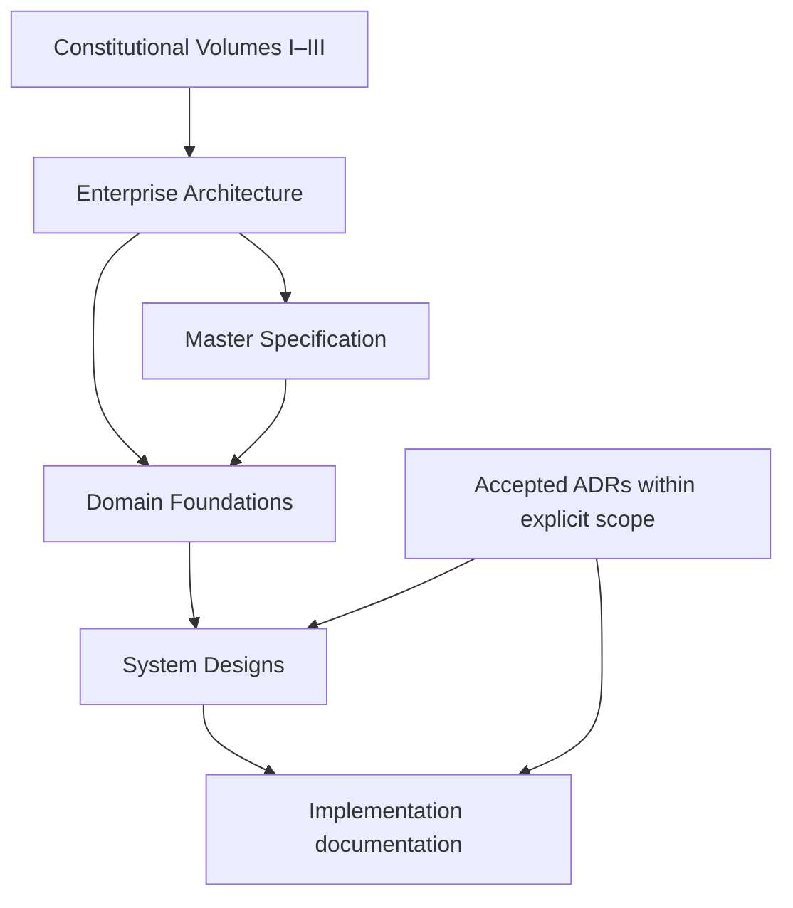
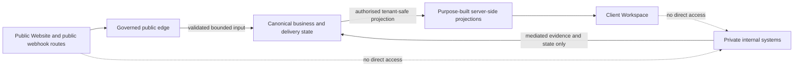

# YSWORKS Architecture Map

## Purpose

This index connects public-safe architectural authorities. It does not expose
private YS AI OS topology or assert that a future component is implemented.

## Architectural Chain

Accepted ADRs govern only their explicit technical scope. The complete
precedence and conflict rule is in the [Authority Map](AUTHORITY_MAP.md).

## System Boundary Map

| System or boundary | Public status | Governing source |
| --- | --- | --- |
| Public Website | Public product | [Master Specification](../YSWORKS_MASTER_SPEC.md) and [Secure Public Platform Foundation](../architecture/SECURE_PUBLIC_PLATFORM_FOUNDATION.md) |
| Client Workspace | Future authenticated client-facing product | [Client Experience Constitution](../CLIENT_EXPERIENCE_CONSTITUTION.md) |
| Client Portal | Technical and security boundary for the Client Workspace | [Client Portal Foundation](../architecture/CLIENT_PORTAL_FOUNDATION.md) |
| YS AI OS | Private internal infrastructure; not a public brand | [Company Bible](../COMPANY_BIBLE.md) and [Enterprise Architecture](../YSWORKS_ENTERPRISE_ARCHITECTURE.md) |
| n8n | Private mandate-bound executor | [Enterprise Architecture](../YSWORKS_ENTERPRISE_ARCHITECTURE.md) and [Authority System Design](../architecture/AUTHORITY_MANDATE_APPROVAL_AUDIT_SYSTEM.md) |
| Public edge and webhook boundary | Limited public interface | [Secure Public Platform Foundation](../architecture/SECURE_PUBLIC_PLATFORM_FOUNDATION.md) |
| Future business data and APIs | Private implementation, not selected | [Canonical Domain Model](../architecture/CANONICAL_DOMAIN_MODEL.md) |

## Contract Map

| Concern | Primary contract | Required companion |
| --- | --- | --- |
| Company domains and information flow | [Enterprise Architecture](../YSWORKS_ENTERPRISE_ARCHITECTURE.md) | Constitutional volumes |
| Product and ecosystem vocabulary | [Master Specification](../YSWORKS_MASTER_SPEC.md) | Founder decisions |
| Public exposure and webhooks | [Secure Public Platform Foundation](../architecture/SECURE_PUBLIC_PLATFORM_FOUNDATION.md) | Security decisions and applicable ADRs |
| Client-facing architecture | [Client Portal Foundation](../architecture/CLIENT_PORTAL_FOUNDATION.md) | Volume III and Canonical Domain Model |
| Authority and consequential execution | [Authority System Design](../architecture/AUTHORITY_MANDATE_APPROVAL_AUDIT_SYSTEM.md) | Enterprise Architecture and accepted ADRs |
| Shared business entities | [Canonical Domain Model](../architecture/CANONICAL_DOMAIN_MODEL.md) | Authority System Design |
| Interface implementation | [Production Design System](../../design-system/README.md) | [Approved Design Authorities](../design/README.md) |
| Public Website code | [Engineering Knowledge Base](../../.ai/README.md) | Master Specification and applicable ADRs |

## Trust And Information Boundaries

The dotted relationships are prohibitions, not network paths.

## Architecture Maintenance

- Add a system design only after identifying its constitutional, enterprise,
  product, authority, and domain-model parents.
- Keep public-safe responsibilities separate from private topology.
- Do not promote future design into deployed-state language.
- Record unresolved provider, runtime, schema, and deployment choices as open.
