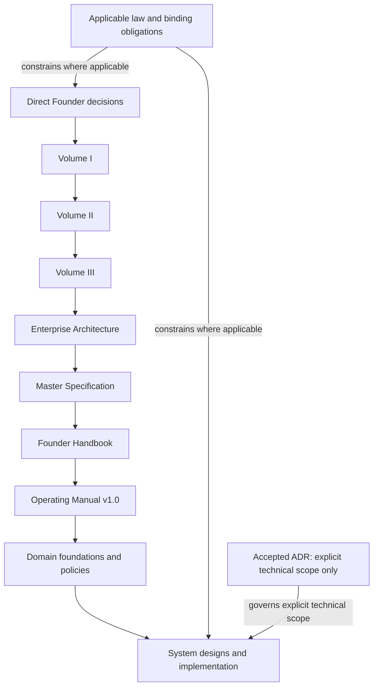

# YSWORKS Documentation Authority Map

## Purpose

This is a navigation aid for established authority. It does not amend or
reinterpret any constitutional document.

## Precedence

| Order | Authority | Scope |
| --- | --- | --- |
| 1 | Direct Founder decision | Highest internal authority |
| 2 | Applicable law and binding contractual obligation | Prevails where applicable |
| 3 | Accepted ADR | Only the explicit technical decision and scope it governs |
| 4 | [Volume I — Company Bible](../COMPANY_BIBLE.md) | Company-wide narrative and behaviour |
| 5 | [Volume II — Brand Bible](../BRAND_BIBLE.md) | Identity, subordinate to Volume I |
| 6 | [Volume III — Client Experience Constitution](../CLIENT_EXPERIENCE_CONSTITUTION.md) | Client experience, subordinate to Volumes I and II |
| 7 | [YSWORKS Enterprise Architecture](../YSWORKS_ENTERPRISE_ARCHITECTURE.md) | Enterprise structure within its domain |
| 8 | [YSWORKS Master Specification](../YSWORKS_MASTER_SPEC.md) | Product, ecosystem, vocabulary, and cross-system decisions |
| 9 | [Founder Handbook](../FOUNDER_HANDBOOK.md) | Human behaviour and operating discipline |
| 10 | [YSWORKS Operating Manual](../OPERATING_MANUAL.md) | Operational-class day-to-day company procedures; owner Operations; amendments approved by Governance |
| 11 | Domain foundations and policies | Detailed domain rules within stated scope |
| 12 | System designs, workflow definitions, and implementation documentation | Conforming implementation detail |

## Authority Graph

The graph is a navigation summary. Applicable law and binding obligations are
not subordinate nodes. An ADR does not enter the constitutional chain and
cannot govern outside its accepted technical scope.

## Scope Resolution

Authority is not determined by filename, document length, recency, or proximity
to code. Use this order:

1. identify the decision and affected domain;
2. locate the highest applicable authority;
3. apply a lower document only inside its declared scope;
4. apply an ADR only inside its explicit accepted technical scope;
5. stop and report a genuine contradiction; and
6. use the more conservative behaviour until governance resolves it.

## Domain Authorities

| Domain | Detailed authority |
| --- | --- |
| Public platform and exposure | [Secure Public Platform Foundation](../architecture/SECURE_PUBLIC_PLATFORM_FOUNDATION.md) |
| Client Workspace technical boundary | [Client Portal Foundation](../architecture/CLIENT_PORTAL_FOUNDATION.md) |
| Authority, mandates, approvals, execution, and audit | [Authority System Design](../architecture/AUTHORITY_MANDATE_APPROVAL_AUDIT_SYSTEM.md) |
| Canonical business entities and tenancy | [Canonical Domain Model](../architecture/CANONICAL_DOMAIN_MODEL.md) |
| Company operating policies and templates | [Company Documentation](../company/README.md) |
| Public business and website strategy | [Business Foundation](../business/README.md) |
| Design authority versions and sources | [Approved Design Authorities](../design/README.md) |
| UI implementation standards | [Production Design System](../../design-system/README.md) |
| Public Website implementation | [Engineering Knowledge Base](../../.ai/README.md) and accepted ADRs |

## Conflict Rule

No index, glossary, map, README, workflow, code comment, generated output, or
implementation convenience can silently settle a conflict. Conflicts are
recorded, linked to the affected authorities, and escalated to the required
human seat.
