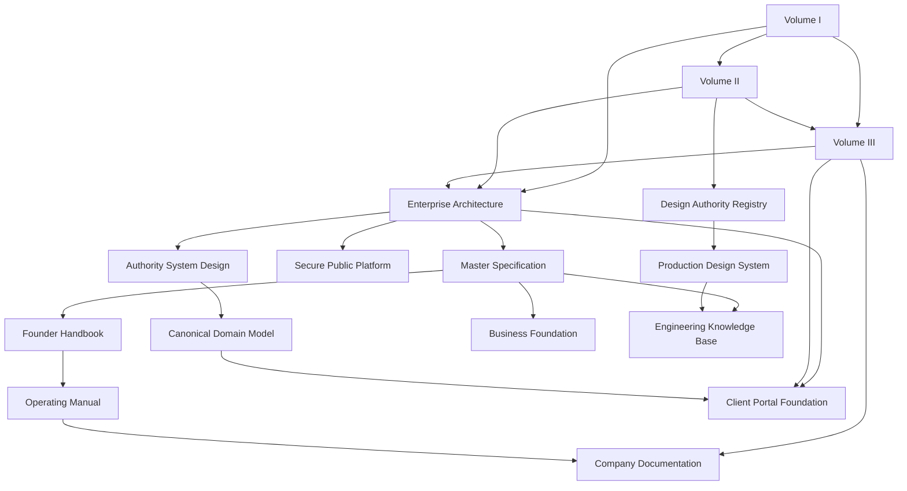

# YSWORKS Documentation Dependency Map

## Purpose

This map shows which documents must be reviewed when another authority changes.
It is not a package, runtime, infrastructure, or deployment dependency graph.

## Governing Dependencies

Arrows mean “must conform to or review”, not “overrides”.

## Change-Impact Matrix

| Changed authority | Minimum review set |
| --- | --- |
| Company Bible | Every constitutional volume, Enterprise Architecture, Master Specification, Founder Handbook, all domain indexes |
| Brand Bible | Design authority registry, operational Brand Book, Production Design System, engineering brand guidance |
| Client Experience Constitution | Client Portal Foundation, company client policies, business journey documents, Workspace projections |
| Enterprise Architecture | Master Specification, architecture contracts, company/business indexes, private conformance requirements |
| Master Specification | Founder Handbook, Operating Manual, business foundation, public architecture, design registry, engineering knowledge |
| Founder Handbook | Operating Manual and company operating policies |
| Operating Manual | Company policies, procedures, templates, operational records, and future operational tooling |
| Authority System Design | Canonical Domain Model, Client Portal approvals, future workflow and agent designs |
| Canonical Domain Model | Client Portal data contracts, future schemas/APIs, company lifecycle and support mappings |
| Accepted ADR | Only documents and implementation inside the ADR's explicit scope |
| Design authority registry | Production Design System and affected implementation guidance |
| Production Design System | Component library and affected public pages |

## Implementation Consumers

| Documentation set | Current or future consumer |
| --- | --- |
| Business foundation | Public Website content and information architecture |
| Production Design System | Public Website components and pages |
| Client Portal Foundation + Canonical Domain Model | Future Client Workspace |
| Authority System + Canonical Domain Model | Future YS AI OS, n8n, APIs, storage, audit, and approval boundaries |
| Company policies | Human operators, future operational systems, proposals, delivery, support |
| Branding governance | Future approved vector assets, documents, presentations, product surfaces |

## Dependency Rules

- A lower-level change cannot redefine its parent authority.
- A link to a document is a dependency only where the surrounding text assigns
  scope or conformance.
- Historical supporting sources remain subordinate to their current governed
  registry.
- Missing planned documents are not implicit authority.
- A future implementation must record the exact versions of the contracts it
  implements.
