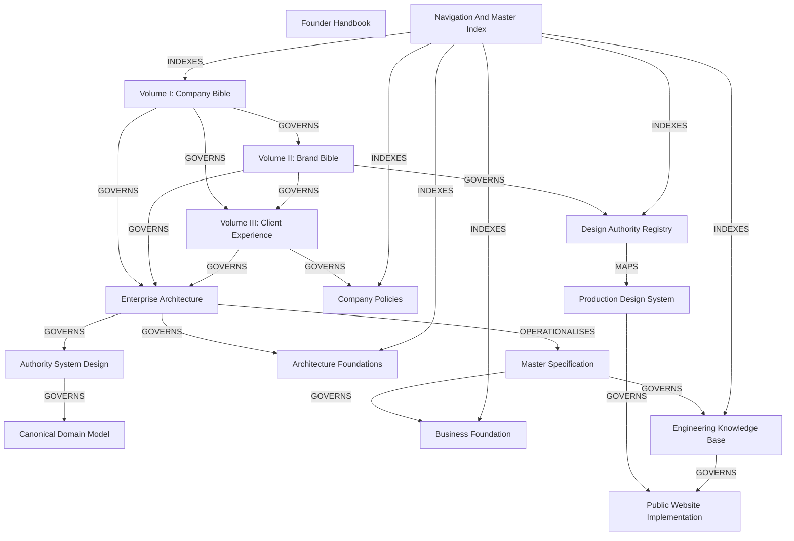
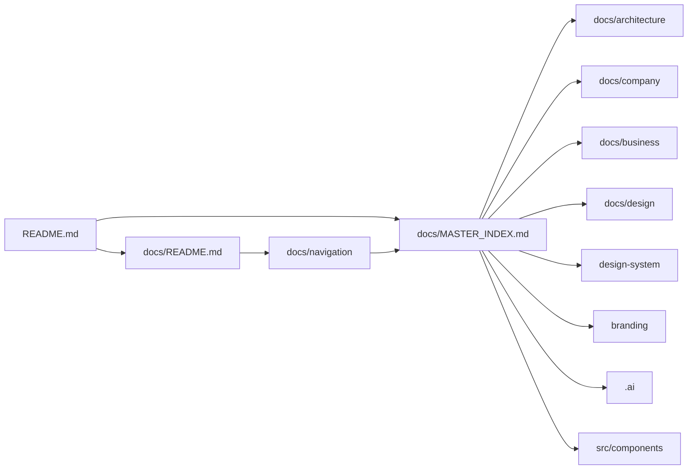

# YSWORKS Document Graph

## Purpose

This graph shows how document classes relate. It complements:

- the [Authority Map](AUTHORITY_MAP.md), which resolves precedence;
- the [Dependency Map](DEPENDENCY_MAP.md), which defines change impact; and
- the [Master Index](../MASTER_INDEX.md), which inventories every maintained
  document.

It does not create new authority.

## Relationship Types

| Edge | Meaning |
| --- | --- |
| `GOVERNS` | Higher authority constrains a lower document within scope |
| `OPERATIONALISES` | Converts higher principles into a more detailed contract |
| `MAPS` | Records an approved name, version, source, or relationship |
| `SUPPORTS` | Provides subordinate context without governing |
| `IMPLEMENTS` | Describes or contains implementation conforming to documentation |
| `INDEXES` | Makes documents discoverable without changing their meaning |

## Governed Graph

An arrow is meaningful only with its label. `INDEXES` never implies authority.
Accepted ADRs are omitted from the diagram for readability; each applies only
to its explicit technical scope and affected implementation.

## Folder Graph

## Cross-Reference Rules

- Canonical and foundational documents link downward only when necessary; they
  do not need to enumerate every consumer.
- Lower documents link to the exact governing source and relevant scope.
- Folder READMEs link back to the Master Index or a maintained map.
- Historical filenames receive a current descriptive label at the link.
- A glossary definition links to its primary contract.
- An acronym entry expands usage but does not select a technology.
- Navigation documents may repeat a title, path, status, and one-sentence
  purpose; they must not repeat normative prose.

## Coverage And Duplicate Controls

| Control | Required result |
| --- | --- |
| Reachability | Every maintained Markdown file has an inbound link or is a README entry point |
| Master inventory | Every maintained Markdown file is present or covered through its indexed folder |
| Broken links | No unresolved local file or heading anchor |
| Duplicate authority | No repeated normative section creates a competing source |
| Naming | Historical filename and current governed meaning are distinguished |
| Search | Canonical name and common alias resolve to the same source |
| Private boundary | No map exposes private topology, prompts, secrets, workflows, or client records |

## Maintenance

When adding or changing documentation:

1. identify its authority class;
2. add it to the Master Index;
3. link it from the applicable folder README;
4. add a graph edge only when a real governance or implementation relationship
   exists;
5. update glossary or acronym aliases only when the term is genuinely reused;
6. run reachability, link, duplicate, authority, secret, and diff validation.
